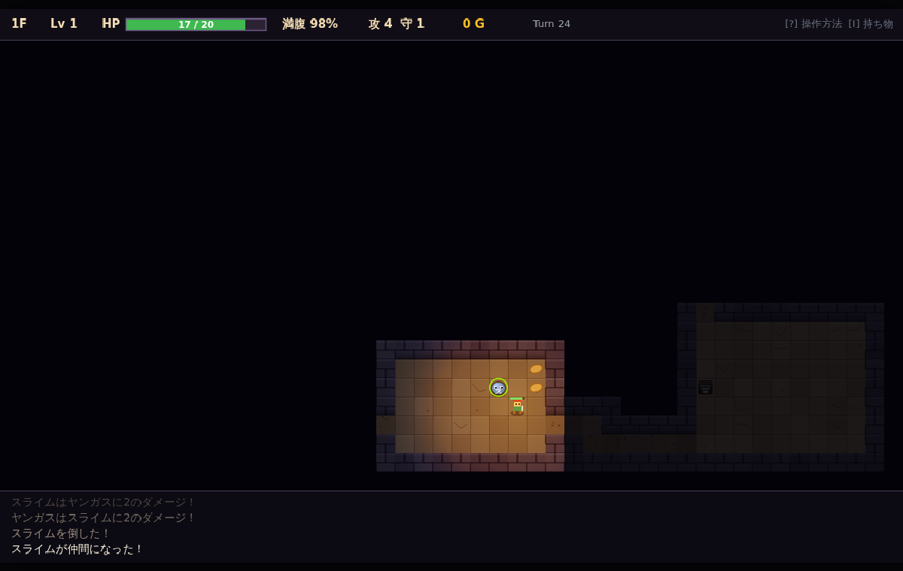

# demo-web-MysteryDungeon

「少年ヤンガスと不思議のダンジョン」風ローグライクのブラウザ版クローン。
Claude Fable 5.1 の設計・実装能力を評価するためのデモリポジトリです。権利物のアセットは使用していません。



## 特徴

- ランダム生成ダンジョン（セクター分割＋全域木）、部屋単位の視界、ターン制 8 方向移動
- 戦闘・レベル・満腹度・状態異常、アイテム（武器 / 盾 / 食料 / 草 / 種 / 巻物 / 杖 / 素材）
- ヤンガス要素: **壺**（保存・錬金・合成・変化）、**錬金レシピ**、**仲間モンスター**、**ガーゴイルの店**、**図鑑**、**リレミトの巻物**
- **拠点**は歩ける横スクロールの村。家（倉庫・設定）・武器屋（買う・売る）・牧場・配合所・図書館（図鑑）・ダンジョン入り口を歩いて回る。拠点は localStorage に保存
- **仲間システム**: 牧場で管理して最大3体を連れて行く、作戦（ガンガン／いのちだいじに／ついてこい）、種族ごとの特技、配合（種族レシピ＋系統配合）で全20種族
- **ダンジョンテーマ**: 石の洞窟 → 地底湖（壁の代わりに水）→ 氷の洞窟（滑る床）→ 火山（焼ける溶岩）→ 天空の浮島（壁の代わりに空）。水や空は投げ物・魔法弾が飛び越える
- **モンスターハウス**: 眠った敵とアイテムが詰まった部屋。踏み込むと一斉に起きる
- **罠・番人・鍛冶屋**: 隠し罠6種（罠見破りの巻物・トラップの杖）、階段を守る番人、ゴールドで装備を鍛える鍛冶屋
- **地形が動く**: 地底湖の満潮で橋が沈む、天空は歩いた回廊が崩れる、押せる岩で足場を作る、跳ね床・泉・石碑
- キャラ・敵・アイテム・地形すべて 32×32 のピクセルアート（コードで生成、外部アセットなし）＋松明ライティング
- 移動・攻撃・ダメージ数字・投げ物・魔法弾・ブレス・撃破などの演出アニメーション、階移動・出撃・帰還のフェード遷移（ロジックとは分離）
- 敵の見た目を「クラシック／モンスター娘」で切り替えられる（拠点の設定。内部データは共通）
- **コマンドパターン**: seed + コマンド列で完全リプレイ可能。Vitest で回帰テスト
- ゲームロジック（`src/domain`）は DOM 非依存の純粋 TypeScript

## 動かす

```bash
npm install
npm run dev        # http://localhost:5173/
npm test           # Vitest
npm run build      # dist/ に静的ファイル
```

`http://localhost:5173/?seed=12345` のようにシードを固定できます。

## 操作

| 操作 | キー |
| --- | --- |
| 移動 | 矢印 / WASD（直交）、Q E Z C（斜め）、テンキー |
| ダッシュ | Shift + 方向（通路を自動で追従） |
| 足踏み | `.` / Space |
| 拾う | `,` / G（移動時は自動） |
| 階段を降りる | 階段上で Enter |
| 持ち物 | I / Tab → Enter でアクション、R で整頓 |
| 図鑑 | M |
| 拠点で歩く／施設に入る | ← → ／ ↑ または Enter |
| 作戦切替 | T |
| ヘルプ | `/` |
| リプレイ書き出し / 読み込み | P / O |

## ドキュメント

- [01 要件定義](docs/01_要件定義.md)
- [02 アーキテクチャ設計](docs/02_アーキテクチャ設計.md)
- [03 ゲームシステム設計](docs/03_ゲームシステム設計.md)
- [04 データ定義（マスター）](docs/04_データ定義.md)
- [05 テストとリプレイ](docs/05_テストとリプレイ.md)
- [06 拠点・ショップ・図鑑](docs/06_拠点・ショップ・図鑑.md)
- [07 仲間システム](docs/07_仲間システム.md)
- [08 ダンジョンテーマとモンスターハウス](docs/08_ダンジョンテーマとモンスターハウス.md)
- [09 ギミック提案](docs/09_ギミック提案.md)
- [10 ギミック実装記録](docs/10_ギミック実装.md)

## 技術

TypeScript 5 / Vite 8 / Vitest 5 / Canvas 2D。フレームワーク・ゲームエンジンは使用していません。
