# アーキテクチャ設計書

## 1. レイヤー構成

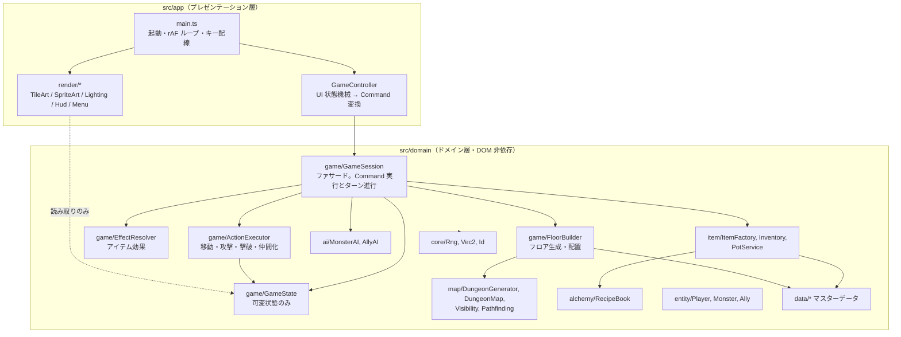

### 依存ルール
- `app` → `domain` の一方向のみ。`domain` は `window`/`document` を参照しない。
- `render/*` は `GameState` を**読むだけ**。状態変更は必ず `GameSession.execute(Command)` を通す。
- `data/*` は純粋なオブジェクトリテラル（マスターデータ）。ロジックを持たない。

## 2. 主要クラス

| クラス | 責務 | SOLID 上の位置づけ |
| --- | --- | --- |
| `GameSession` | 1 プレイのファサード。`Command` を受け取り、ターンを進める | Facade。UI からの唯一の入口 |
| `GameState` | フロア・ターン・アクター・床上アイテムなどの可変状態 | データ保持のみ（SRP） |
| `ActionExecutor` | 移動・攻撃・ダメージ・撃破・仲間化の共通処理 | プレイヤーと AI が同じルールを共有（DRY） |
| `EffectResolver` | `ItemEffect`（判別共用体）をゲーム状態へ適用 | 新効果は union に追加＋分岐追加（OCP は限定的） |
| `FloorBuilder` | 地形生成→配置。出現テーブルの重み抽選 | 生成手順の集約 |
| `DungeonGenerator` | セクター分割方式の地形生成 | `GeneratorConfig` で差し替え可能 |
| `Visibility` | 部屋単位の視界と探索済み記憶 | 描画とロジックの両方が利用 |
| `PotService` | 壺 4 種のルール | 状態は `ItemInstance` に、ルールはサービスに（分離） |
| `RecipeBook` | レシピ検索（多重集合一致）と発見管理 | データ駆動 |
| `MonsterAI` / `AllyAI` | `AiAction` を返す純粋な判断 | 判断と実行の分離（`perform()` は Session 側） |
| `IRng` / `SeededRng` | 乱数抽象と決定論的実装 | DIP。テストで差し替え可能 |
| `ShopService` | 店の値札・支払い・売却・どろぼう | ルールを 1 か所に集約 |
| `Codex` | 図鑑の登録状況 | 拠点とセッションで同一インスタンスを共有 |
| `HomeBase` / `Campaign` | 出撃をまたぐ状態と、出撃⇄帰還の反映 | セッションと拠点の分離 |
| `BaseStorage` | 永続化先の抽象（localStorage / メモリ） | DIP |
| `SkillExecutor` | 特技の効果適用（対象選定は AI） | 判断と実行の分離 |
| `AllyAI` + `Tactic` | 作戦パラメータで挙動を切り替え | データ駆動の戦略 |

## 3. コマンドパターン

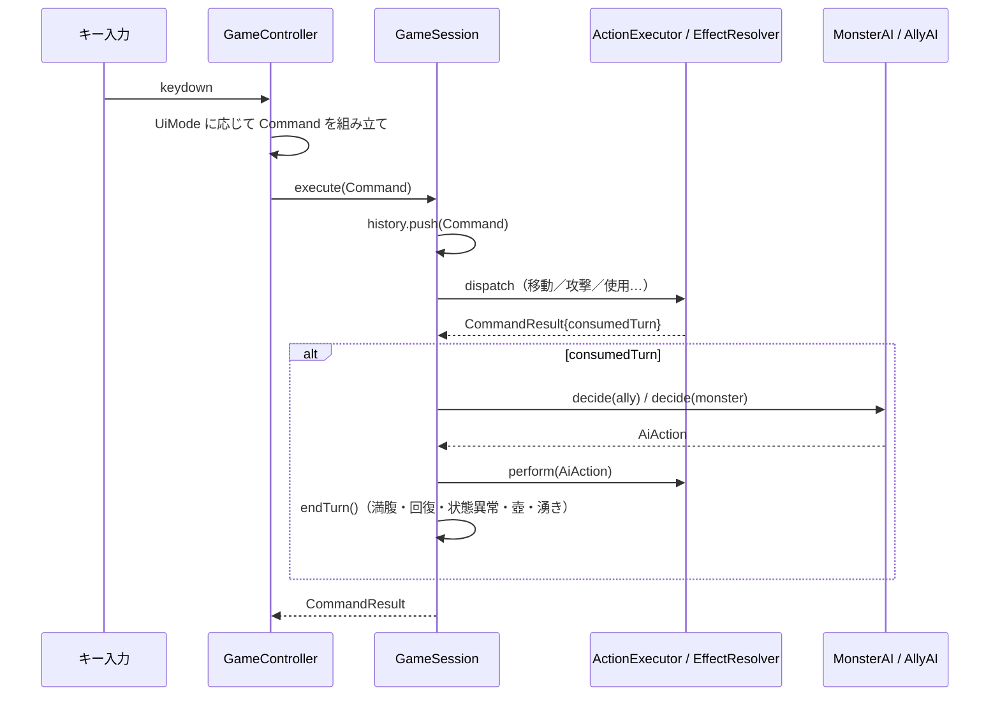

- `Command` はアイテムを**実体ではなくインデックス**で参照する。これにより JSON 化とリプレイが可能。
- `GameSession.replay({seed, commands})` は新しいセッションを作って同じコマンド列を流すだけ。
  乱数消費順が同じである限り、完全に同一の状態になる（`tests/replay.test.ts` で回帰検証）。

## 4. グラフィック（32×32 ピクセルスプライト）

すべての絵（主人公・モンスター・アイテム・地形タイル）は 32×32 の `PixelSprite`（文字グリッド＋パレット）で統一している。タイルサイズも 32px。

| ファイル | 内容 |
| --- | --- |
| `sprites/PixelSprite.ts` | スプライト型、`recolor()`、`SpriteCache`（倍率ごとにオフスクリーンへ焼く）、`paintSprite()` |
| `sprites/PixelCanvas.ts` | 32×32 グリッドのビルダー。`ellipse` / `rect` / `line` / `trapezoid` / `stamp`（手描き断片）/ `mirror` / `outline`（自動縁取り）/ `shadeBottom` |
| `sprites/monsterSprites.ts` | クラシック版 12 種族（色違いは `recolor` で形を共有） |
| `sprites/monsterGirlSprites.ts` | モンスター娘版 12 種族。共通の少女ベースに髪色・衣装色・アクセサリ（翼・角・王冠・耳・ハンマー…）を重ねる |
| `sprites/heroSprite.ts` | 主人公 |
| `sprites/itemSprites.ts` | カテゴリごとの原型 10 種 × 定義ごとのパレット差し替え（剣の刃色、壺の種類色など） |
| `sprites/tileSprites.ts` | 石壁・奥の岩・石畳 2 種・通路・階段 |
| `RenderSettings.ts` | スキン設定（`classic` / `girl`）。localStorage `mysterydungeon.settings.v1` に保存。URL `?skin=girl` でも指定可 |

### スキン切り替えの仕組み

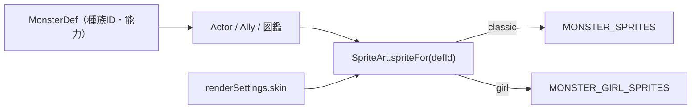

- スキンは描画層だけで解決する。ドメイン層（種族ID・ステータス・AI・図鑑の記録・リプレイ）には一切影響しない。
- `SpriteCache` のキーにスキン名を含めるため、切り替え直後から正しい絵になる。
- 拠点メニュー「設定」→「敵の見た目」で切替（プレビュー付き）。

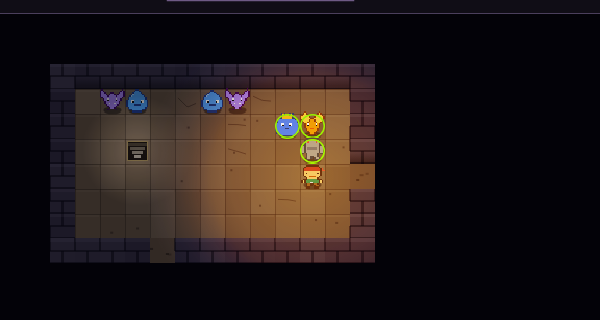
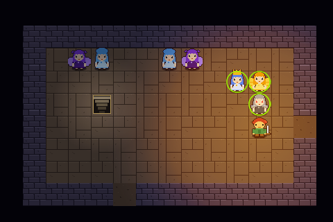
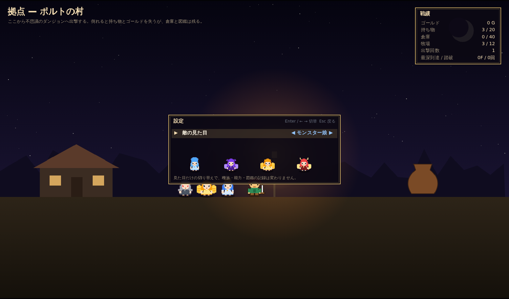

### 描画パイプライン

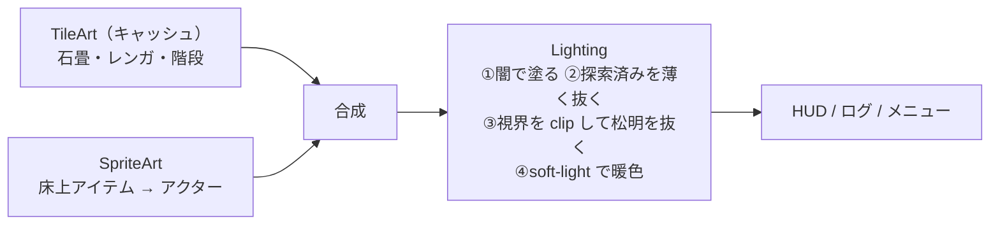

ライティングは `destination-out` で「闇の層」を削る方式。視界外へ光が漏れないよう視界タイルで `clip()` している。
松明の半径は `sin` 2 波の合成でゆらぐ。

## 4.5 演出（アニメーション）レイヤー

ゲームロジックは即座に状態を更新し、描画側だけが「何が起きたか」を時間をかけて見せる。

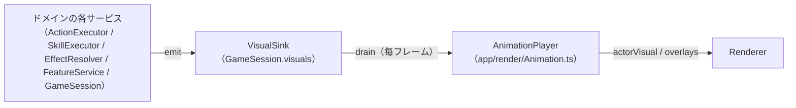

| イベント | 発行元 | 見え方 |
| --- | --- | --- |
| `move` | 移動・入れ替え・吹き飛ばし・滑走 | タイル間をスライド（110ms、fast は一気に） |
| `attack` | 通常攻撃・近接特技 | 相手へ踏み込んで戻るランジ |
| `damage` / `miss` | ダメージ処理・命中判定 | 数字ポップアップ（自分側は赤、敵側は白）＋揺れ、MISS |
| `heal` / `popup` | 回復・特技名・状態異常・罠・レベルアップ・仲間化 | 頭上に浮かぶテキスト |
| `death` | 撃破 | スプライトが白く弾けて消える |
| `projectile` | 投擲（item）・杖（bolt）・ブレス（breath） | 軌道を飛ぶ／炎が走る |
| `teleport` | ワープ | フェードアウト／イン |
| `floor` | 階の移動 | 再生中の演出を破棄 |

- 連続する `move` は同時再生（敵が一斉に動く）。攻撃・投擲・ワープは順番に再生し、その間は通路ダッシュを止める。
- 再生中に次の入力が来たら `skip()` で動きを省略して即応答する（連打しても操作が遅れない）。
- イベントはリプレイや状態に一切影響しない（`tests/visuals.test.ts`）。

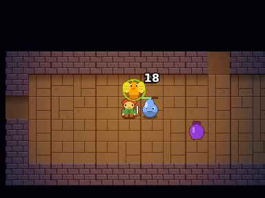 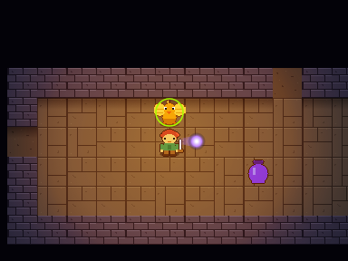

## 4.6 画面遷移（SceneTransition）

`app/render/Transition.ts`。開始時に描画キャンバスのスナップショットを撮り、
**[前の画面 → 色へフェード] → [タイトルカード] → [新しい画面へフェード]** を重ねて描く。
状態の切り替え自体は即時（スナップショットが隠す）なので、ドメインには手を入れない。遷移中は入力を受け付けない。

| 場面 | 起動元 | 見え方 |
| --- | --- | --- |
| 階段・落とし穴 | `GameController.consumeFloorChange()`（`floor` 演出イベント） | 暗転 → 「3F  地底湖」。テーマが変わる階は説明文つきで長め |
| 出撃 | `AppController.startSortie()` | 拠点から暗転 → 「出撃  1F  石の洞窟」＋説明 |
| 力尽きた | `GameController.consumeEnded()` | 赤黒く沈む → 「力尽きた…」 → 結果パネル |
| 踏破 ／ リレミト | 同上 | 白／水色の光に包まれる → 結果パネル |
| 拠点へ戻る | `AppController.returnToBase()` | 暗転 → 「拠点へ」＋帰還メッセージ → 拠点の帰還パネル |

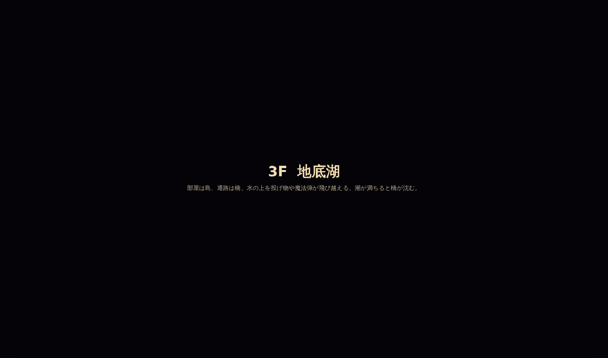 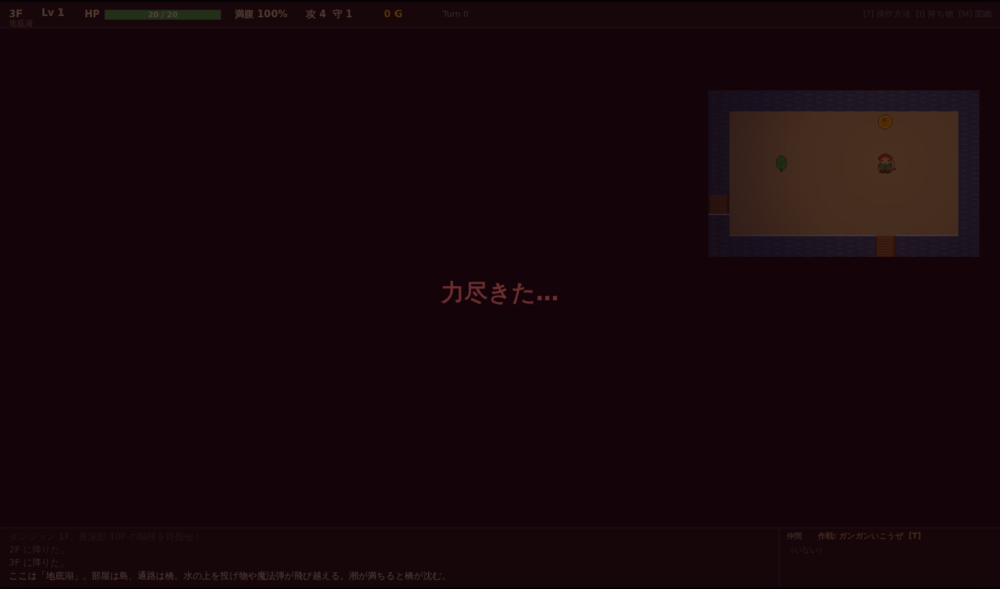

## 5. ディレクトリ

```
src/
  domain/
    core/      Vec2, Rng, Id
    map/       Tile, Room, DungeonMap, DungeonGenerator, Pathfinding, Visibility
    entity/    Actor, Player, Monster, Ally, MonsterDef, StatusEffect
    item/      ItemDef, ItemInstance, ItemFactory, Inventory, PotService
    alchemy/   Recipe, RecipeBook
    ai/        AiAction, AiUtil, MonsterAI, AllyAI
    game/      GameState, GameSession, Command, ActionExecutor, EffectResolver, FloorBuilder, Combat, Placement, MessageLog,
               ShopService, Codex, SkillExecutor, Tactic
    base/      HomeBase, Campaign（出撃をまたぐメタ層）
    data/      monsters, items, recipes, spawnTables, skills, breeding
  app/
    AppController.ts   拠点 ⇄ ダンジョンのシーン切替・永続化
    GameController.ts
    base/      BaseController, BaseRenderer, BaseStorage
    input/KeyMap.ts
    ui/UiState.ts, ItemActionMenu.ts
    render/RenderConfig, TileArt, SpriteArt, Lighting, HudRenderer, MenuRenderer, Renderer, CodexRenderer, Animation, Transition
    render/sprites/PixelSprite, monsterSprites, heroSprite
    main.ts
tests/         Vitest（ドメイン層のみ。DOM 不要）
docs/          本ドキュメント群
```
