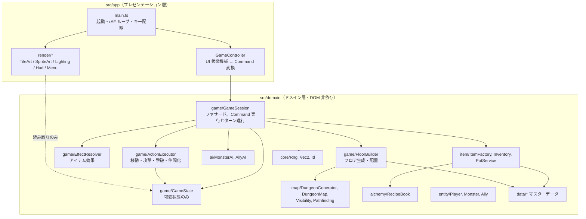
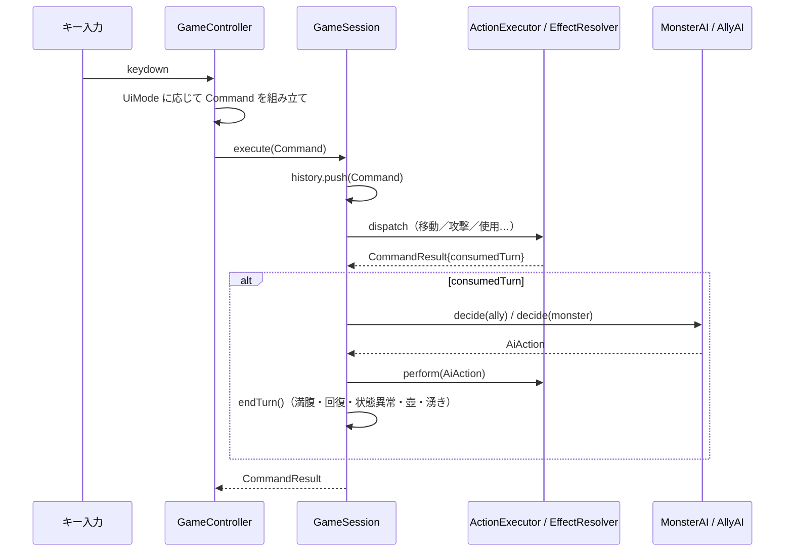
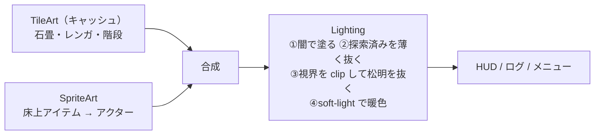

# アーキテクチャ設計書

## 1. レイヤー構成



### 依存ルール
- `app` → `domain` の一方向のみ。`domain` は `window`/`document` を参照しない。
- `render/*` は `GameState` を**読むだけ**。状態変更は必ず `GameSession.execute(Command)` を通す。
- `data/*` は純粋なオブジェクトリテラル（マスターデータ）。ロジックを持たない。

## 2. 主要クラス

| クラス | 責務 | SOLID 上の位置づけ |
| --- | --- | --- |
| `GameSession` | 1 プレイのファサード。`Command` を受け取り、ターンを進める | Facade。UI からの唯一の入口 |
| `GameState` | フロア・ターン・アクター・床上アイテムなどの可変状態 | データ保持のみ（SRP） |
| `ActionExecutor` | 移動・攻撃・ダメージ・撃破・仲間化の共通処理 | プレイヤーと AI が同じルールを共有（DRY） |
| `EffectResolver` | `ItemEffect`（判別共用体）をゲーム状態へ適用 | 新効果は union に追加＋分岐追加（OCP は限定的） |
| `FloorBuilder` | 地形生成→配置。出現テーブルの重み抽選 | 生成手順の集約 |
| `DungeonGenerator` | セクター分割方式の地形生成 | `GeneratorConfig` で差し替え可能 |
| `Visibility` | 部屋単位の視界と探索済み記憶 | 描画とロジックの両方が利用 |
| `PotService` | 壺 4 種のルール | 状態は `ItemInstance` に、ルールはサービスに（分離） |
| `RecipeBook` | レシピ検索（多重集合一致）と発見管理 | データ駆動 |
| `MonsterAI` / `AllyAI` | `AiAction` を返す純粋な判断 | 判断と実行の分離（`perform()` は Session 側） |
| `IRng` / `SeededRng` | 乱数抽象と決定論的実装 | DIP。テストで差し替え可能 |
| `ShopService` | 店の値札・支払い・売却・どろぼう | ルールを 1 か所に集約 |
| `Codex` | 図鑑の登録状況 | 拠点とセッションで同一インスタンスを共有 |
| `HomeBase` / `Campaign` | 出撃をまたぐ状態と、出撃⇄帰還の反映 | セッションと拠点の分離 |
| `BaseStorage` | 永続化先の抽象（localStorage / メモリ） | DIP |
| `SkillExecutor` | 特技の効果適用（対象選定は AI） | 判断と実行の分離 |
| `AllyAI` + `Tactic` | 作戦パラメータで挙動を切り替え | データ駆動の戦略 |

## 3. コマンドパターン



- `Command` はアイテムを**実体ではなくインデックス**で参照する。これにより JSON 化とリプレイが可能。
- `GameSession.replay({seed, commands})` は新しいセッションを作って同じコマンド列を流すだけ。
  乱数消費順が同じである限り、完全に同一の状態になる（`tests/replay.test.ts` で回帰検証）。

## 4. 描画パイプライン



ライティングは `destination-out` で「闇の層」を削る方式。視界外へ光が漏れないよう視界タイルで `clip()` している。
松明の半径は `sin` 2 波の合成でゆらぐ。

## 5. ディレクトリ

```
src/
  domain/
    core/      Vec2, Rng, Id
    map/       Tile, Room, DungeonMap, DungeonGenerator, Pathfinding, Visibility
    entity/    Actor, Player, Monster, Ally, MonsterDef, StatusEffect
    item/      ItemDef, ItemInstance, ItemFactory, Inventory, PotService
    alchemy/   Recipe, RecipeBook
    ai/        AiAction, AiUtil, MonsterAI, AllyAI
    game/      GameState, GameSession, Command, ActionExecutor, EffectResolver, FloorBuilder, Combat, Placement, MessageLog,
               ShopService, Codex, SkillExecutor, Tactic
    base/      HomeBase, Campaign（出撃をまたぐメタ層）
    data/      monsters, items, recipes, spawnTables, skills, breeding
  app/
    AppController.ts   拠点 ⇄ ダンジョンのシーン切替・永続化
    GameController.ts
    base/      BaseController, BaseRenderer, BaseStorage
    input/KeyMap.ts
    ui/UiState.ts, ItemActionMenu.ts
    render/RenderConfig, TileArt, SpriteArt, Lighting, HudRenderer, MenuRenderer, Renderer
    main.ts
tests/         Vitest（ドメイン層のみ。DOM 不要）
docs/          本ドキュメント群
```
