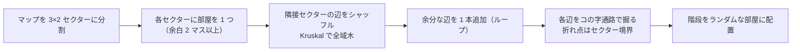
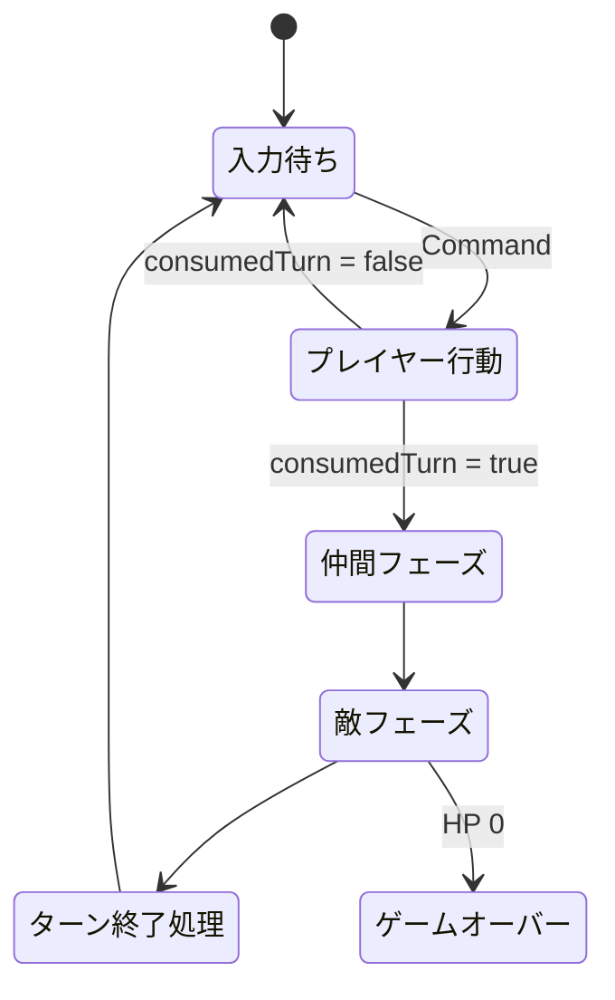
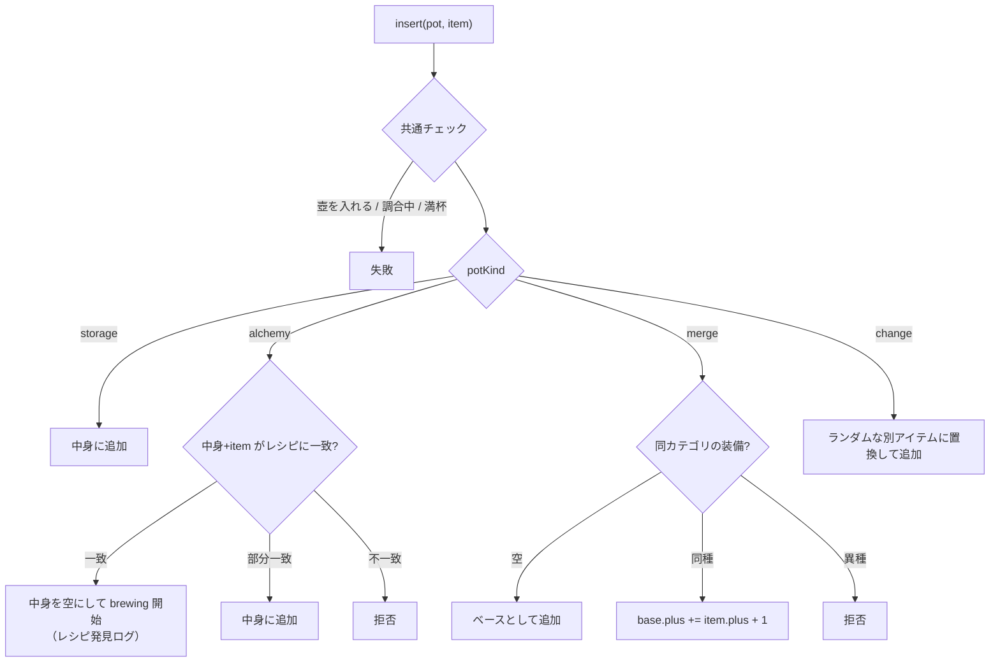

# ゲームシステム設計書

## 1. ダンジョン生成

- 通路は既存の床を上書きしない（`carveTile` は壁のみ通路化）。
- 斜め移動は両側の直交マスが床のときのみ許可（`DungeonMap.canStep`）。攻撃も同じ判定を使うので、角越しに殴れない。

## 2. 視界

| 位置 | 見える範囲 |
| --- | --- |
| 部屋の中 | 部屋全体＋外周 1 マス（出入口が見える） |
| 通路 | 周囲 1 マス |

- 見えたマスは `explored` に記憶され、以後は薄暗く表示される。
- 敵は視界内のみ描画。床上アイテムは探索済みなら描画（記憶）。

## 3. ターン進行

ターン終了処理の順序:
1. `turn++`
2. `turn % hungerInterval == 0` で満腹度 −1（20 / 0 で警告）
3. 満腹度 0 なら HP −1、そうでなければ `regenInterval` ごとに HP +1（仲間も）
4. 全アクターの状態異常を 1 ターン消化
5. 所持している壺の調合を 1 ターン進める
6. `respawnInterval` ごとに敵を 1 体追加（上限 10）

## 4. 戦闘式

| 項目 | 式 |
| --- | --- |
| ダメージ | `max(1, floor((ATK − DEF/2) × U[0.875, 1.125)))` |
| 命中 | 90% |
| プレイヤー ATK | `baseAtk + 武器.atk + 武器.plus` |
| プレイヤー DEF | `baseDef + 盾.def + 盾.plus` |
| レベルアップ | 必要 EXP = `floor(10 × 1.6^(Lv−1))`、HP+4 / ATK+2 / DEF+1 |
| 仲間レベルアップ | 必要 EXP = `floor(8 × 1.5^(Lv−1))`、HP+3 / ATK+2 / DEF+0.5 |
| 投擲ダメージ | 武器なら `atk + plus`、それ以外 2（`throwDamage` で上書き可） |
| 吹き飛ばし | 壁まで移動し、敵なら着地時に 5 ダメージ |

## 5. AI

### 敵（`MonsterAI`）
1. 混乱中 → ランダム方向へ移動／そこに誰かいれば攻撃
2. 隣接するプレイヤー or 仲間 → 攻撃
3. 同じ部屋か 2 マス以内に標的 → BFS で接近（最後に見た位置を記憶）
4. 記憶がある → そこへ向かう
5. それ以外 → 徘徊

### 仲間（`AllyAI`）
1. 混乱中 → ランダム
2. 隣接する敵 → 攻撃
3. 気づいた敵がプレイヤーから 5 マス以内 → 接近
4. プレイヤーから 2 マス以上離れている → 追従
5. 待機

## 6. アイテムと効果

| カテゴリ | 動詞 | 効果の種類（`ItemEffect.kind`） |
| --- | --- | --- |
| 武器 / 盾 | 装備 / 外す | — |
| 食料 | 食べる | `feed` |
| 草 | 食べる | `heal` / `fullHeal`（満タン時は最大 HP +1） |
| 種 | 食べる | `maxHpUp` / `atkUp` / `defUp` |
| 巻物 | 読む | `revealMap` / `teleport` / `confuseVisible` |
| 杖 | 振る（向いている方向） | `boltParalyze` / `boltKnockback` / `boltDamage` |
| 壺 | 入れる / 出す | 種類別ルール（下記） |
| 素材 | — | 錬金の素材 |
| ゴールド | 踏むと取得 | `20〜60 × フロア` |

## 7. 壺

- 壺を投げると割れて、中身が着地点付近に散らばる。

## 8. 錬金レシピ

| 完成品 | 素材 | ターン |
| --- | --- | --- |
| じょうやくそう | やくそう ×2 | 20 |
| とくやくそう | じょうやくそう ×2 | 30 |
| おおきなパン | パン ×2 | 20 |
| いのちのきのみ | やくそう + せいすい | 40 |
| てつのつるぎ | どうのつるぎ + てつのかたまり | 50 |
| てつのたて | うろこのたて + てつのかたまり | 50 |
| ドラゴンキラー | てつのつるぎ + まもののキバ + せいすい | 80 |

## 9. 仲間化

- プレイヤーがトドメを刺したとき、`MonsterDef.recruitChance` で判定。
- 仲間枠（既定 2）に空きがあれば、倒した位置の近くに `Ally` として出現。
- 仲間は敵を倒すと自身に経験値が入る。

## 10. ライティング仕様

| レイヤー | 合成モード | 内容 |
| --- | --- | --- |
| 闇 | source-over | `rgb(3,2,8)` で全面塗り |
| 記憶 | destination-out α0.22 | 探索済み・視界外タイル |
| 視界ベース | destination-out α0.5（視界で clip） | 部屋全体を読める明るさに |
| 松明 | destination-out 放射状（半径 7 タイル、ゆらぎ ±5%） | プレイヤー中心 |
| 階段の光 | destination-out 放射状（半径 2.2 タイル） | 目印 |
| 暖色 | soft-light 放射状（視界で clip） | 松明のオレンジ → 周辺は紫 |
