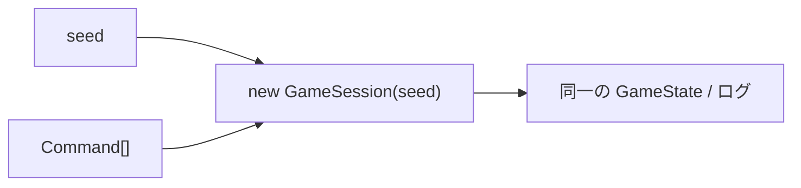

# テストとリプレイ

## 1. テスト構成

| ファイル | 内容 |
| --- | --- |
| `tests/rng.test.ts` | シード付き乱数の決定論・範囲 |
| `tests/dungeon.test.ts` | 100 シードで全床タイルの連結・階段到達、部屋の非重複、角抜け禁止 |
| `tests/combat.test.ts` | ダメージ式の範囲、レベルアップ |
| `tests/pot.test.ts` | 保存／錬金／合成／変化の壺、レシピ検索 |
| `tests/session.test.ts` | 初期配置、ランダム操作 300 ターンの不変条件（10 シード）、リプレイ一致、戦闘・装備・使用・置く／拾う・壺・飢餓・階段・仲間化 |
| `tests/replay.test.ts` | 記録済み fixture の再生結果が固定値と一致（回帰） |
| `tests/dash.test.ts` | 通路ダッシュの追従と停止条件、敵が見えたら走らない、整頓の並び順とリプレイ |

```bash
npm test          # 一括実行
npm run test:watch
npm run typecheck
```

## 2. リプレイの仕組み



- `GameSession.toReplay()` で `{ seed, commands }` を取得できる。
- `GameSession.replay(replay, options)` で再生。
- ブラウザでは `P` キーでクリップボードにコピー、`O` キーで貼り付けて再生。
- `?seed=12345` の URL パラメータで初期シードを固定できる。

## 3. 不具合報告からの再現手順

1. 発生時に `P` キーでリプレイ JSON をコピーしてもらう。
2. `tests/fixtures/` に保存し、次のようなテストを書く。

```ts
const fx = JSON.parse(readFileSync('tests/fixtures/bug-123.json', 'utf8'));
const s = GameSession.replay(fx.replay, fx.options);
expect(s.state.player.hp).toBeGreaterThan(0); // 期待する状態
```

3. 修正後もこのテストを残せば回帰を防げる。

## 4. 回帰 fixture の再生成

ルール変更で `tests/replay.test.ts` が落ちた場合、意図した変更であることを確認したうえで、
`tests/replay.test.ts` 冒頭のコメントに従い fixture の `expected` を更新する。
（生成に使ったコマンド列は fixture 内 `replay.commands` に残っている）
