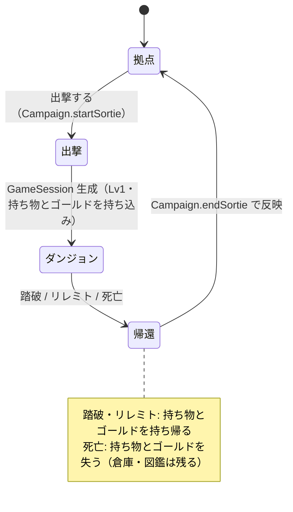
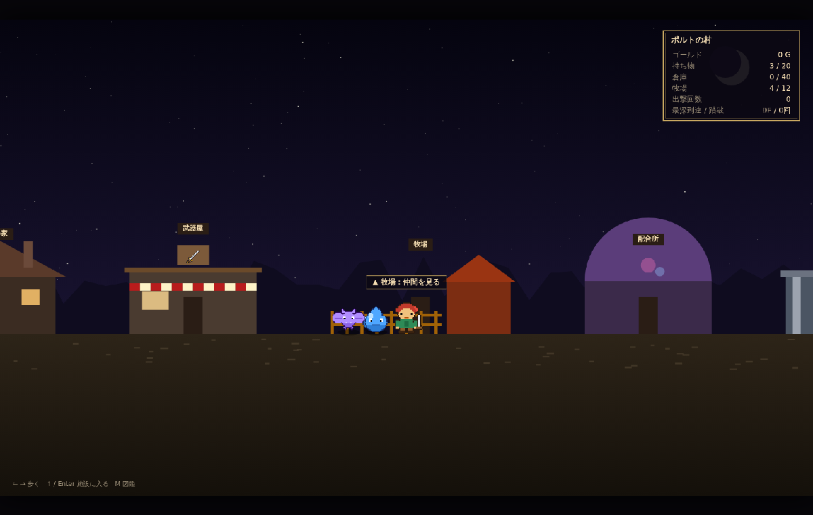
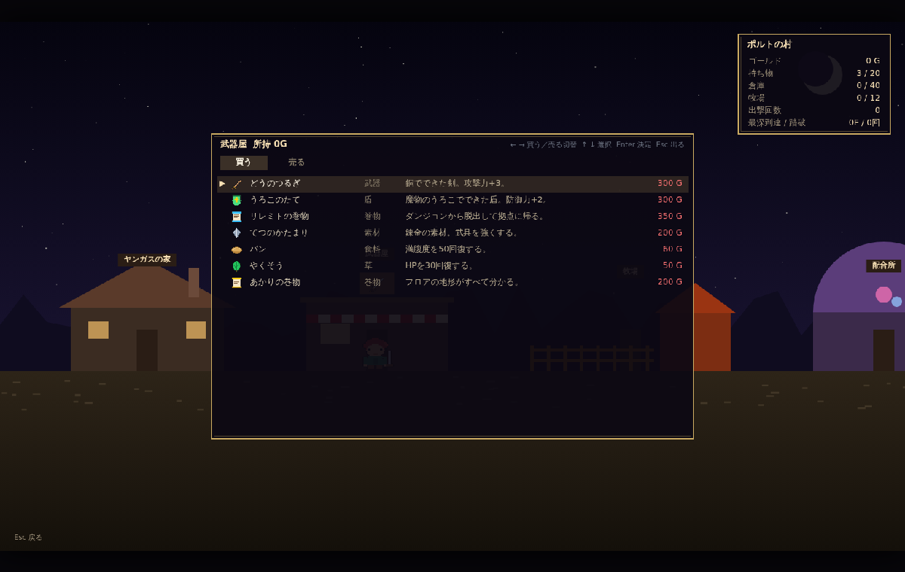
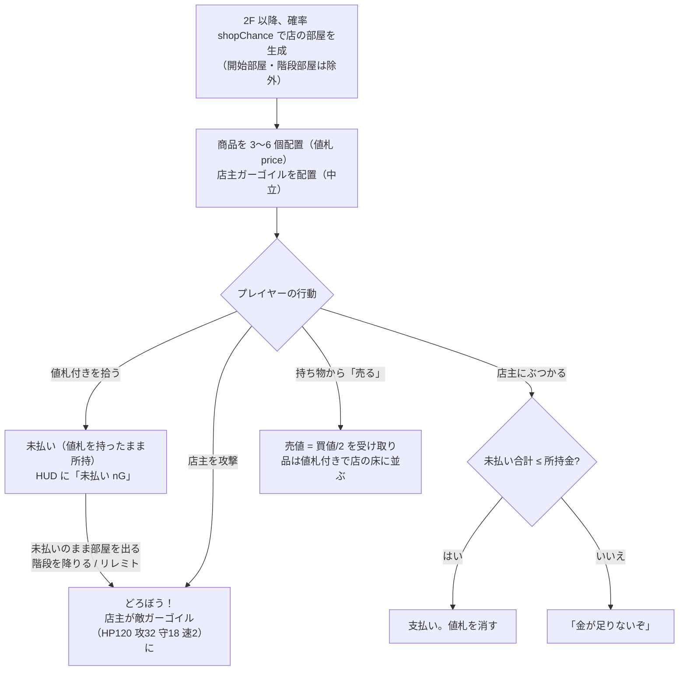
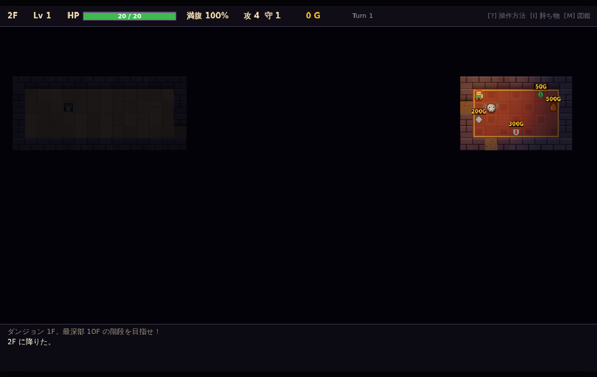
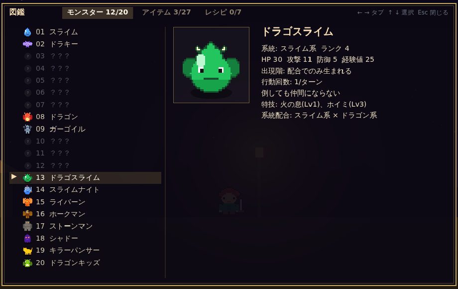

# 拠点・ガーゴイルの店・図鑑・リレミト 設計書

## 1. 全体の流れ（メタゲーム層）

| クラス | 場所 | 責務 |
| --- | --- | --- |
| `HomeBase` | `domain/base/HomeBase.ts` | 持ち物・倉庫・ゴールド・図鑑・戦績。`toJSON/fromJSON` で永続化 |
| `Campaign` | `domain/base/Campaign.ts` | 出撃開始と帰還時の反映（拠点 ⇄ セッションの橋渡し） |
| `Codex` | `domain/game/Codex.ts` | 図鑑の登録状況（モンスター／アイテム／レシピ） |
| `ShopService` | `domain/game/ShopService.ts` | 店のルール一式 |
| `AppController` | `app/AppController.ts` | 拠点 ⇄ ダンジョンのシーン切替と `localStorage` 保存 |
| `BaseController` / `BaseRenderer` | `app/base/` | 拠点画面の入力と描画 |
| `CodexView` / `CodexRenderer` | `app/ui`, `app/render` | 図鑑画面（拠点・ダンジョン共通） |

### 1.1 拠点（ポルトの村）— 歩ける村

横スクロールの村を ←→（A/D）で歩き、施設の前で ↑ または Enter で入る。連れて行く仲間は後ろをついて歩く。

| 施設（左→右） | 中身 |
| --- | --- |
| ヤンガスの家 | 倉庫（持ち物 20 ⇄ 倉庫 40）、設定（敵の見た目） |
| 武器屋 | 買う（品揃え 7 品、定価。出撃するたびに入れ替わる）／売る（半額、修正値分も加味。中身入りの壺は不可） |
| 牧場 | 仲間の一覧。連れて行く／留守番、逃がす |
| 配合所 | 2 体を順に選んで配合（種族レシピ→系統レシピ→ランク） |
| 図書館 | 図鑑（`M` キーでも開く） |
| ダンジョン入り口 | 出撃の確認 |

- 武器屋の品揃えは `BaseShop.generateStock(出撃回数)` で決定論的に生成し、`HomeBase.shopStock` に保存する。
- 帰還すると主人公はダンジョン入り口の前に立つ。
- 倉庫: 持ち物（20）⇄ 倉庫（40）の移動。← → で列切替、Enter で移動。
- 戦績: ゴールド・持ち物数・倉庫数・出撃回数・最深到達／踏破回数。
- 初回起動時の持ち物: どうのつるぎ・パン・やくそう。
- 永続化: `HomeBaseJson` を `localStorage`（キー `mysterydungeon.home.v1`）に保存。アイテムは `ItemSnapshot`（定義ID・修正値・杖の回数・壺の中身・調合状態）で表現。

武器屋の画面:

### 1.2 リプレイとの関係
- 出撃時の持ち込み品は `Replay.startingInventory`（スナップショット）と `startingGold` として記録される。
- `GameSession.replay()` はそれらを復元してからコマンド列を流すため、持ち込み品込みで再現できる（`tests/campaign.test.ts`）。

## 2. ガーゴイルの店

| 項目 | 仕様 |
| --- | --- |
| 買値 | `price + max(0, plus) × floor(price × 0.2)` |
| 売値 | 買値の半分 |
| 未払い判定 | 所持品（壺の中身を含む）の値札合計 |
| 店内に置く | 未払い品は棚に戻る（値札を持ったまま床へ） |
| 敵の湧き | 店の部屋には湧かない |
| 見た目 | 赤い絨毯＋金の縁取り、商品の上に値札、店主は石の翼付き |

## 3. 図鑑

- 登録タイミング
  - モンスター: 視界内に入ったとき（店主も含む）
  - アイテム: 拾った／持ち込んだ／錬金で作ったとき
  - レシピ: 錬金の壺でそのレシピが成立したとき
- 未発見は「？？？」。発見済みは HP・攻防・出現階・仲間確率、買値／売値・説明、素材と完成ターンを表示。
- 拠点の `Codex` を `GameSession` に渡して共有するため、出撃をまたいで蓄積される。

## 4. リレミトの巻物

- `ItemEffect { kind: 'escape' }`。読むと `GameStatus = 'escaped'` になりコマンドを受け付けなくなる。
- 未払いがあれば脱出前に「どろぼう」扱い（値札は消える。店主は追ってこない）。
- 帰還後、持ち物とゴールドは拠点に反映される。
- 出現テーブル: 重み 3、1F〜10F。買値 350G。

## 5. 追加した操作

| 操作 | キー |
| --- | --- |
| 図鑑 | M（拠点・ダンジョン共通） |
| 倉庫の列切替 | ← → |
| 帰還画面を閉じる | 任意のキー |
| リプレイ読み込み | 拠点で O（デバッグ用、拠点には反映されない） |

## 6. テスト

| ファイル | 内容 |
| --- | --- |
| `tests/shop.test.ts` | 値札・未払い・支払い・どろぼう・売却・店主攻撃、100 シードで店の配置制約、リレミト、図鑑登録 |
| `tests/campaign.test.ts` | スナップショット往復、拠点の倉庫と容量、JSON 保存／復元、出撃と帰還（脱出・死亡）、持ち込み品込みリプレイ |
