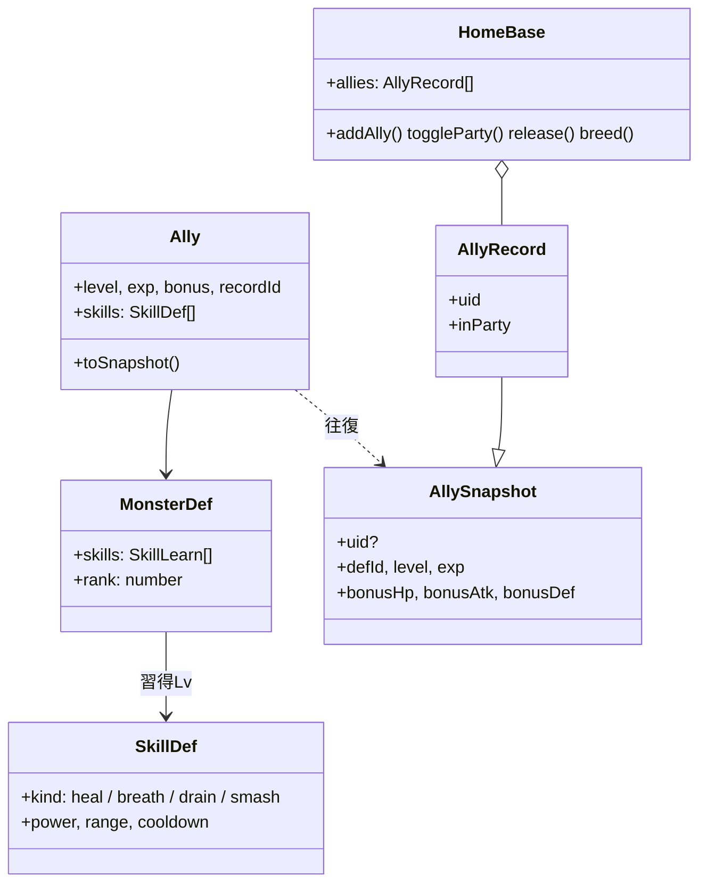
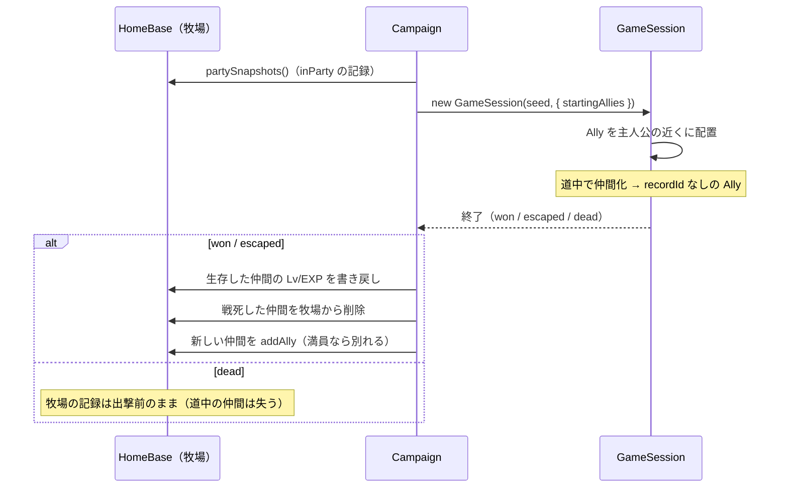
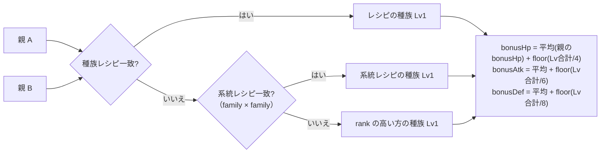
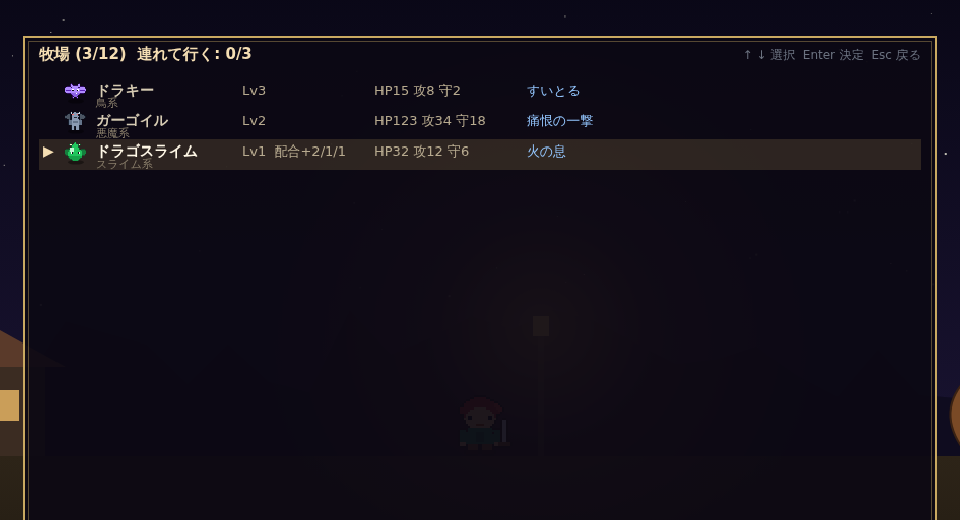
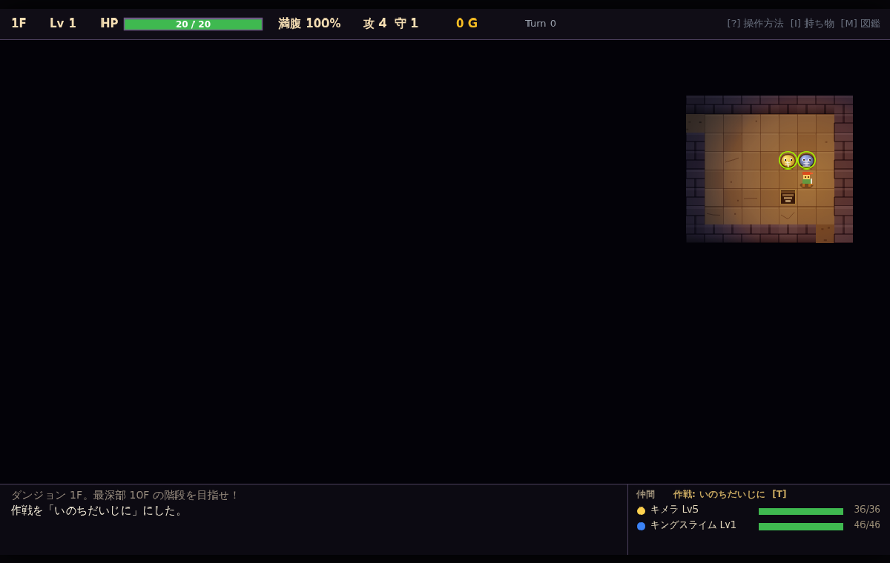

# 仲間システム 設計書

## 1. 概要

| 要素 | 内容 |
| --- | --- |
| 仲間化 | プレイヤーがトドメを刺した魔物が種族ごとの確率で**起き上がり**、仲間になる（最大 3 体） |
| 牧場 | 拠点で仲間を預かる（12 体）。出撃時に「連れて行く」を最大 3 体まで指定 |
| 作戦 | ガンガンいこうぜ／いのちだいじに／ついてこい。ダンジョン内で `T` キー、コマンドとして記録 |
| 特技 | 種族ごとにレベルで習得。クールダウン制。敵も同じ特技を使う |
| 配合 | 牧場で 2 体を消費して子を作る。レシピがあれば新種族。ボーナスを継承 |

## 2. データ構造

- `Ally` のステータス: `HP = 種族HP + bonusHp + (Lv−1)×3`、`攻 = 種族攻 + bonusAtk + (Lv−1)×2`、`守 = 種族守 + bonusDef + floor((Lv−1)/2)`
- 特技は `MonsterDef.skills` の `level` に達したものだけ使える（敵はすべて使える）。

## 3. 出撃と帰還の流れ

- `Replay.startingAllies` に持ち込んだ仲間を含めるため、リプレイでも同じ仲間が同じ位置に出る。

## 4. 作戦（`Tactic`）

| 作戦 | 追跡距離 | 回復閾値 | 退却 | 遠距離特技 | 追従距離 |
| --- | --- | --- | --- | --- | --- |
| ガンガンいこうぜ | 7 | HP 40% 未満の味方 | しない | 使う | 2 |
| いのちだいじに | 3 | HP 70% 未満の味方 | 自分の HP 40% 未満で隣接敵から離れる | 使う | 2 |
| ついてこい | 追わない | HP 50% 未満の味方 | しない | 使わない | 1 |

仲間 AI の優先順: 混乱 → 回復特技 → 隣接敵（退却／近接特技／攻撃）→ ブレス → 追跡 → 追従。

## 5. 特技（`data/skills.ts`）

| ID | 名前 | 種類 | 威力 | 射程 | CD | 効果 |
| --- | --- | --- | --- | --- | --- | --- |
| hoimi | ホイミ | heal | 20 | 2 | 4 | 射程内で最も HP 割合が低い味方を回復 |
| behoimi | ベホイミ | heal | 50 | 2 | 6 | 同上 |
| fire_breath | 火の息 | breath | 14 | 3 | 3 | 直線上（縦横斜め）の敵すべてにダメージ |
| big_fire | 激しい炎 | breath | 30 | 3 | 4 | 同上 |
| drain | すいとる | drain | 100% | 1 | 3 | 通常攻撃し、与えたダメージの半分を回復 |
| smash | 痛恨の一撃 | smash | 180% | 1 | 4 | 1.8 倍ダメージ |

### 種族と習得レベル

| 種族 | 特技 |
| --- | --- |
| スライム | ホイミ(Lv2) |
| ドラキー | すいとる(Lv1) |
| おおきづち | 痛恨の一撃(Lv3) |
| ゴースト | すいとる(Lv1)※仲間にならない |
| スライムベス | ホイミ(Lv1) |
| キメラ | 火の息(Lv1)、ベホイミ(Lv5) |
| ゴーレム | 痛恨の一撃(Lv1) |
| ドラゴン | 火の息(Lv1)、激しい炎(Lv6) |
| ガーゴイル | 痛恨の一撃(Lv1)、火の息(Lv4) |
| キングスライム（配合） | ホイミ(Lv1)、ベホイミ(Lv4) |
| タホドラキー（配合） | すいとる(Lv1)、ホイミ(Lv3) |
| メタルドラゴン（配合） | 激しい炎(Lv1)、痛恨の一撃(Lv3) |
| ドラゴスライム（系統配合） | 火の息(Lv1)、ホイミ(Lv3) |
| スライムナイト（系統配合） | 痛恨の一撃(Lv1)、ホイミ(Lv2) |
| ライバーン（系統配合） | 火の息(Lv1)、激しい炎(Lv5) |
| ホークマン（系統配合） | すいとる(Lv1)、痛恨の一撃(Lv4) |
| ストーンマン（系統配合） | 痛恨の一撃(Lv1) |
| シャドー（系統配合） | すいとる(Lv1) |
| キラーパンサー（系統配合） | 痛恨の一撃(Lv1) |
| ドラゴンキッズ（系統配合） | 火の息(Lv2) |

## 6. 配合（`data/breeding.ts`）

子は Lv1、両親は消える。解決順は **種族レシピ → 系統レシピ → ランクの高い方の種族**。

### 6.1 系統

| 系統 | 種族 |
| --- | --- |
| スライム系 | スライム、スライムベス、キングスライム、ドラゴスライム、スライムナイト |
| 鳥系 | ドラキー、タホドラキー、キメラ、ライバーン、ホークマン |
| 物質系 | ゴーレム、メタルドラゴン、ストーンマン |
| ドラゴン系 | ドラゴン、ドラゴンキッズ |
| ゾンビ系 | ゴースト、シャドー |
| 獣系 | おおきづち、キラーパンサー |
| 悪魔系 | ガーゴイル |

### 6.2 種族レシピ（優先）

| 親 | 子 |
| --- | --- |
| スライム × スライム | キングスライム |
| ドラキー × ドラキー | タホドラキー |
| ゴーレム × キメラ | ガーゴイル |
| キングスライム × ドラゴン | メタルドラゴン |

### 6.3 系統レシピ（順不同）

| 系統 × 系統 | 子 | 子の系統 |
| --- | --- | --- |
| スライム × ドラゴン | ドラゴスライム | スライム |
| スライム × 獣 | スライムナイト | スライム |
| 鳥 × ドラゴン | ライバーン | 鳥 |
| 鳥 × 悪魔 | ホークマン | 鳥 |
| 物質 × 物質 | ストーンマン | 物質 |
| ゾンビ × 悪魔 | シャドー | ゾンビ |
| 獣 × 獣 | キラーパンサー | 獣 |
| ドラゴン × ドラゴン | ドラゴンキッズ | ドラゴン |

系統レシピの子は自身の系統を持つので、さらに別系統と掛け合わせて連鎖できる（例: ドラキー×ドラゴン→ライバーン（鳥）→ ×悪魔 → ホークマン）。

## 7. 画面

- **ダンジョン HUD**: ログ右側に仲間一覧（名前・Lv・HP バー）と現在の作戦。`T` で切替。
- **起き上がり演出**: 仲間になった直後 3 ターン、きらめきを表示。ログに「起き上がり、仲間になりたそうにこちらを見ている…」。
- **牧場画面**: 一覧（種族・Lv・配合ボーナス・HP攻守・特技・★連れて行く）→ Enter でアクション（連れて行く／留守番、配合する、逃がす）。
- **拠点の広場**: 連れて行く仲間が主人公の横に並ぶ。
- **帰還画面**: 仲間の増減（帰ってこなかった／牧場に加わった）を補足表示。
- **図鑑**: 特技と配合レシピを表示。

## 8. テスト（`tests/ally.test.ts`）

| 観点 | 内容 |
| --- | --- |
| Ally | ステータス式、特技習得、スナップショット往復、クールダウン |
| 特技 | ホイミ（仲間 AI）、火の息（敵 AI・直線）、すいとる（回復）、痛恨の一撃（倍率） |
| 作戦 | ついてこい＝追わない、ガンガン＝接近、いのちだいじに＝退却、コマンドがリプレイに残る |
| 仲間化 | 起き上がりログ、上限 3 体、敵 AI が仲間を狙う |
| 牧場 | 定員、連れて行く上限、逃がす、配合（レシピ／フォールバック／ボーナス／両親消費）、JSON |
| 帰還 | 成長の書き戻し、戦死の削除、新規加入、死亡時の保護、仲間込みリプレイ |
