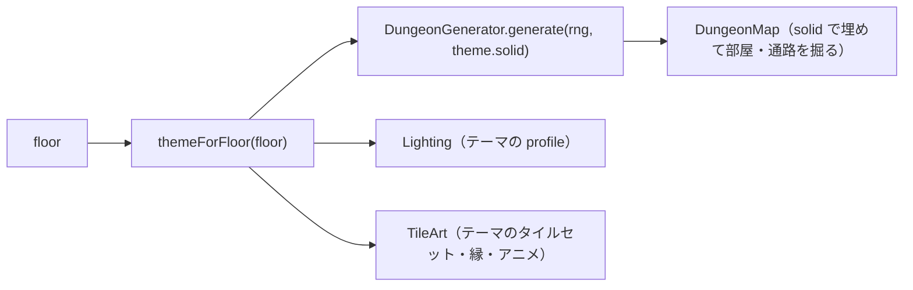
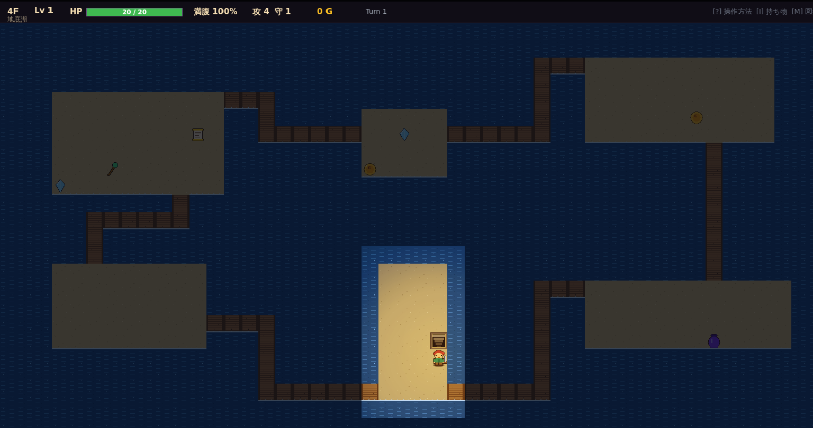
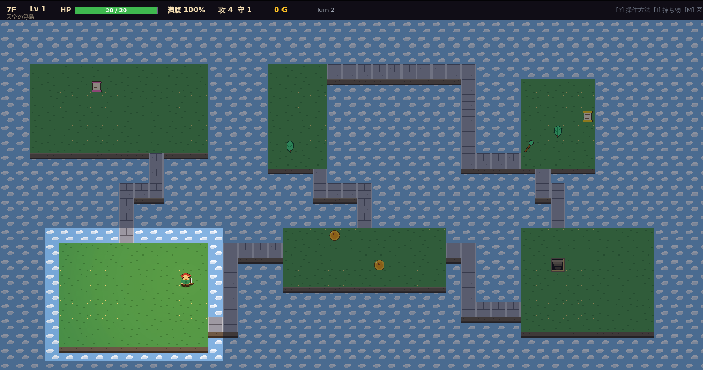
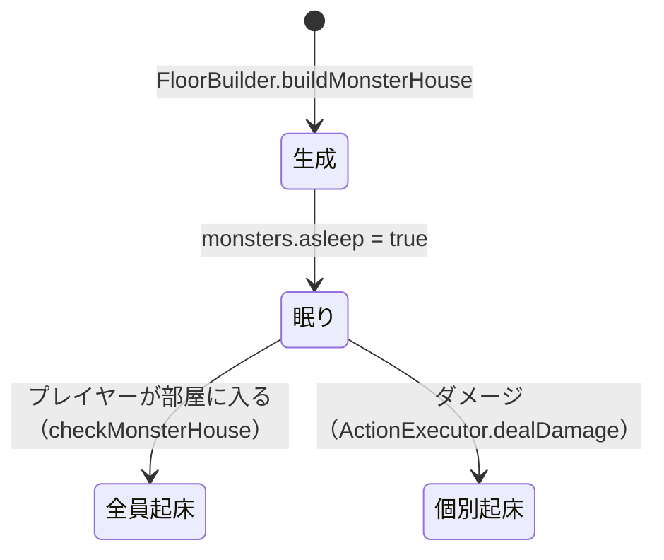
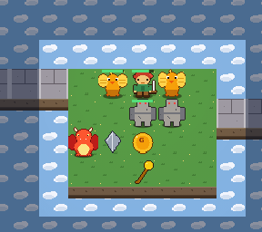

# ダンジョンテーマ（水・空）とモンスターハウス 設計書

## 1. ダンジョンテーマ

フロア帯ごとに「部屋と通路の外側を何で埋めるか」を変える。地形生成アルゴリズムは共通で、`solid` タイルだけを差し替える。

| テーマ | 階 | 外側 | 部屋 | 通路 | ライティング |
| --- | --- | --- | --- | --- | --- |
| 石の洞窟 `cave` | 1〜2F | 岩壁 `Wall` | 石畳 | 土 | 暗い。松明半径 7 |
| 地底湖 `water` | 3〜4F | 水 `Water` | 砂の島 | 木の橋 | やや暗い。松明半径 8、暖色弱め |
| 氷の洞窟 `ice` | 5〜6F | 氷壁 `Wall` | 氷（滑る）＋岩床 | 雪道 | やや明るい青。松明半径 8 |
| 火山 `volcano` | 7〜8F | 赤黒い岩 `Wall` | 玄武岩＋溶岩だまり | 灰の道 | 暗いが溶岩が光る。暖色強め |
| 天空の浮島 `sky` | 9F〜 | 空 `Void` | 草の島 | 石の空中回廊 | 明るい昼光。松明半径 10、暖色ほぼ無し |
| 廃墟の街 `ruins` | 5〜6F（氷と抽選） | 苔むしたレンガ `Wall` | 欠けた石畳 | 路地 | 街区レイアウト（小部屋 12）。店・鍛冶屋が高確率。詳細は `11_ギミック実装2.md` |
| 暗黒の回廊 `dark` | 7〜8F（火山と抽選） | 黒曜石 `Wall` | 黒い石 | 暗い道 | 視界半径 1。松明半径 3。敵の攻撃 +3 |

氷・溶岩の詳細は [10 ギミック実装記録](10_ギミック実装.md) の第3弾を参照。

### 1.1 タイル種別の意味

| タイル | 歩行 | 投擲物・魔法弾・ブレス | 落ちたアイテム |
| --- | --- | --- | --- |
| `Wall` | ✕ | ✕（止まる） | 手前に落ちる |
| `Water` | ✕ | ○（飛び越える） | 沈んで失われる |
| `Void` | ✕ | ○（飛び越える） | 落ちて失われる |
| `Floor` / `Corridor` / `Stairs` | ○ | ○ | 落ちる |
| `Ice` | ○（滑る） | ○ | 落ちる |
| `Lava` | ○（毎ターン 5 ダメージ） | ○ | 燃え尽きる |

- `DungeonMap.isWalkable()` は歩行、`passesProjectile()` は投擲物の判定。投げる／杖／ブレス／敵のブレス照準はすべて後者を使う。
- 斜め移動の角抜け禁止は水・空でも同じ（直交する 2 マスが歩ければ通れる）。

### 1.2 描画
- 水と空は 2 フレーム（0.7 秒ごと）でアニメする。`TileArt` はフレームごとにマップ全体をキャッシュする。
- 縁: 洞窟は壁の影、地底湖は岸辺の白い縁、天空は床の下に崖の面。
- HUD の階数の下にテーマ名を表示。テーマが変わる階に降りたときは説明をログに出す。

## 2. モンスターハウス

| 項目 | 仕様 |
| --- | --- |
| 発生 | 3F 以降、確率 20%（`monsterHouseChance`）。開始部屋・店の部屋は除外 |
| 中身 | 敵 `min(12, max(4, 面積/4))` 体（1 階上の敵まで出る）、アイテム `min(8, max(3, 面積/6))` 個 |
| 眠り | 中の敵は `asleep = true`。AI は待機し、通常湧きもこの部屋には発生しない |
| 起床 | プレイヤーが部屋に足を踏み入れると「モンスターハウスだ！」で全員起床（最後に見た位置＝プレイヤー）。ダメージを受けた敵は個別に起きる |
| 表示 | 眠っている敵の右上に「z」 |

## 3. テスト（`tests/theme.test.ts`）

| 観点 | 内容 |
| --- | --- |
| テーマ | 階→テーマ対応、水・空 solid での連結性と外周、4F で地底湖になりログが出る |
| 投擲 | 水を飛び越えて敵に当たる、水に落ちると失われる、杖の魔法弾も越える、岩壁は止める |
| モンハウ | 30 シードで眠った敵とアイテムが揃う、外にいる間は動かない、踏み込むと一斉起床、ダメージで個別起床 |
