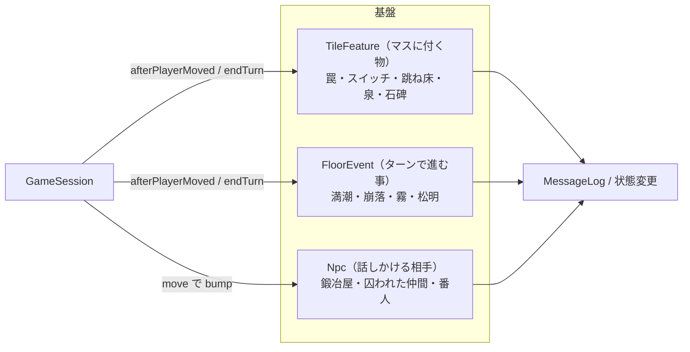

# ダンジョン内ギミック 提案書

現在の実装（テーマ・モンスターハウス・店・仲間・投擲の通過判定・視界・ライティング）に自然に乗るギミックを、
**「タイルに付く物」「フロアで起きる事」「NPC・部屋」「テーマ固有」** の 4 系統に分けて提案する。
工数は S（半日）/ M（1〜2日）/ L（3日〜）の目安。

## 0. 共通基盤の提案

ギミックを個別に作ると `GameSession` が肥大化するので、先に 3 つの受け皿を用意する。

| 基盤 | 置き場所 | フック |
| --- | --- | --- |
| `TileFeature` | `GameState.features: Map<key, TileFeature>`（床上アイテムと同じ持ち方） | `afterPlayerMoved()`（踏む）、`ActionExecutor.move()`（敵・仲間も踏む）、投擲の着地 |
| `FloorEvent` | `GameState.events: FloorEvent[]` | `endTurn()` で `tick()`。フロア生成時に `FloorBuilder` が登録 |
| `Npc` | `Shopkeeper` を一般化した `Npc` 基底（`faction: 'neutral'`） | `cmdMove` の中立判定を `npc.talk(session)` に委譲 |

すべて `Command` を増やさず既存コマンドの副作用として動くので、**リプレイ互換を保てる**。
「見える／見えない」「発動済み」といった状態は `TileFeature` 側に持たせ、描画は `Renderer` が `features` を走査するだけ。

---

## 1. タイルに付く物（TileFeature）

| # | ギミック | 内容 | 遊びの狙い | 実装ポイント | 工数 |
| --- | --- | --- | --- | --- | --- |
| 1-1 | **罠（基本 6 種）** | 落とし穴（次の階へ）、地雷（周囲 1 マスに 20 ダメージ＋床のアイテム消失）、睡眠ガス（3 ターン行動不能）、ワープ、錆び（装備の修正値 −1）、モンスター召喚 | 通路ダッシュや「拾える物は全部拾う」を抑制し、慎重さに価値を出す | 隠し状態 `hidden`。踏むと発動＆可視化。「トラップの杖」で見える化。敵は罠を踏まない（本家準拠）か、踏むかを `MonsterDef` で切替 | M |
| 1-2 | **跳ね床** | 踏むと指定方向へ壁まで吹き飛ぶ | 天空・地底湖の島間ショートカット、逆に敵を飛ばす | `ActionExecutor.knockback()` を流用 | S |
| 1-3 | **押せる岩** | 移動方向に岩を押す。水・空に落とすと足場になる（床化） | 地底湖の「橋を作る」パズル | `TileFeature` `boulder`。押した先が `Water/Void` なら `map.set(Floor)` | M |
| 1-4 | **スイッチ・レバー** | 踏む／隣接して使うと、同フロアの扉が開く・橋が架かる | 探索の順序に意味を持たせる | `FloorBuilder` が「スイッチ ↔ 対象タイル群」を生成。橋は `Corridor` に書き換え | M |
| 1-5 | **鍵と扉・宝物庫** | 鍵アイテム（消費）で開く扉の奥に、上位装備や配合素材 | 目に見えるご褒美 | 扉は歩行不可・投擲不可の `TileFeature`。鍵は `material` 扱い | S |
| 1-6 | **泉** | 回復の泉（HP 全快・1 回）、呪いの泉（装備 −1 だが素材が湧く） | 休憩地点と選択 | 踏むだけ。使用回数を持つ | S |
| 1-7 | **石碑・看板** | フロアのヒント（「この階の店主は気が短い」「東の島に鍵」） | 世界観と誘導 | テキストだけ。`FloorBuilder` が生成結果から文を選ぶ | S |
| 1-8 | **反射壁（鏡）** | 魔法弾・ブレスが跳ね返る壁 | 杖の使いどころを増やす。敵の炎を返す | `passesProjectile` に「反射」の第 3 状態を追加し、`findBoltTarget`/`breath` で方向反転 | M |

## 2. フロアで起きる事（FloorEvent）

| # | ギミック | 内容 | 遊びの狙い | 実装ポイント | 工数 |
| --- | --- | --- | --- | --- | --- |
| 2-1 | **満潮（地底湖）** | 一定ターン後、橋（`Corridor`）が水没して島が孤立。次の干潮まで待つか、跳ね床・ワープで渡る | 「早く階段へ」と「探索したい」の葛藤 | `FloorEvent` が周期で `Corridor ⇄ Water` を切替。上に乗っている者は隣の床へ退避（`findFreeTileNear`） | M |
| 2-2 | **崩落（天空）** | 通った回廊が数ターン後に崩れて `Void` に | 後戻りできない緊張感 | 通過を記録し、N ターン後に崩す。崩壊予告の表示（ひび） | M |
| 2-3 | **霧** | 部屋にいても視界が 2 マスに | 松明・あかりの巻物の価値 | `Visibility.update()` に `radiusOverride`。テーマ天候として発生 | S |
| 2-4 | **松明の寿命** | 松明の半径がターンで縮む。「たいまつ」アイテムで回復 | ライティングをリソースに | `LightingProfile.torchRadius` を状態化。0 になると通路は真っ暗（1 マス） | S |
| 2-5 | **敵の増援（危険度）** | フロア滞在ターンで湧き間隔が短くなる | 滞在の限界を作る | `respawnInterval` を経過で減衰 | S |
| 2-6 | **転がる岩** | 通路を一定周期で岩が転がり、当たると 10 ダメージ＋吹き飛ばし | 通路ダッシュの判断要素 | `FloorEvent` が岩の位置を進める。ダッシュ停止条件に「岩が見えた」を追加 | M |

## 3. NPC・特別な部屋

| # | ギミック | 内容 | 遊びの狙い | 実装ポイント | 工数 |
| --- | --- | --- | --- | --- | --- |
| 3-1 | **番人の部屋** | 階段のある部屋に眠るボス（ゴーレム／ドラゴン強化個体）。倒すか、起こさず通る | 階層のクライマックス | モンスターハウスの `asleep` を流用。起床条件を「隣接」に | S |
| 3-2 | **囚われた仲間** | 檻の中に仲間候補。鍵で開けると加入（確率なし） | 仲間集めの確実な手段。配合素材にも | `Npc` + 檻の `TileFeature`。加入時は `Ally` 生成 | M |
| 3-3 | **鍛冶屋** | ゴールドで武器・盾の修正値 +1（フロアに 1 人） | ゴールドの使い道 | `Npc.talk()` が `plus++`。店と同じ「ぶつかって会話」 | S |
| 3-4 | **闇市（泥棒推奨）** | 店主が不在の店。持ち出しは自由だが出口に番人 | 店の裏返し | `ShopService` の keeper 無し版＋出口に番人 | S |
| 3-5 | **迷路フロア** | 部屋のない細い通路だけのフロア | ダッシュと視界の見せ場 | `DungeonGenerator` の別実装（迷路生成）。`GeneratorConfig` で切替 | M |
| 3-6 | **大部屋フロア** | 全体が 1 部屋。階段が遠い | 遠距離特技・仲間の作戦が活きる | 生成器に `bigRoom` モード | S |

## 4. テーマ固有（新テーマ）

| # | テーマ | 固有ギミック | 実装ポイント | 工数 |
| --- | --- | --- | --- | --- |
| 4-1 | **氷の洞窟** | 氷床は止まるまで滑る（敵も）。火の息で溶けて水に | `TileType.Ice`。`move()` で連続移動。ブレスの着弾で `Ice → Water` | M |
| 4-2 | **火山** | 溶岩は歩けるが毎ターン 5 ダメージ。投げ物は燃える。水の巻物で固まる | `TileType.Lava`（歩行可・ダメージ）。地底湖の逆 | M |
| 4-3 | **廃墟の街** | 崩れた家（小部屋）と店・鍛冶屋が複数 | 生成器に「街区」モード | L |
| 4-4 | **暗黒** | 松明半径 1、あかりの巻物が必須。敵は暗闇で強い | `LightingProfile` だけで実現可 | S |

---

## 5. おすすめの着手順（3 スプリント）

```mermaid
gantt
  title ギミック導入ロードマップ
  dateFormat X
  axisFormat %s
  section 基盤
  TileFeature / FloorEvent / Npc の受け皿 : 0, 2
  section 第1弾（低コスト・効果大）
  罠 6 種 + トラップの杖 : 2, 4
  番人の部屋 : 4, 5
  鍛冶屋 : 5, 6
  section 第2弾（テーマを活かす）
  満潮（地底湖） : 6, 8
  崩落（天空） : 8, 10
  押せる岩・跳ね床 : 10, 12
  section 第3弾（新テーマ）
  氷の洞窟 / 火山 : 12, 16
```

| 順 | 理由 |
| --- | --- |
| 基盤 → 罠 | 罠は最も汎用的で、`TileFeature` の設計を最初に固められる。通路ダッシュの停止条件（「罠が見えた」）とも噛み合う |
| 番人・鍛冶屋 | どちらも既存部品（`asleep`、`Npc` 会話、`plus`）の流用で S。ゴールドの使い道が生まれる |
| 満潮・崩落 | 地底湖・天空の「壁が水／空」という特徴が、見た目だけでなくルールとして効き始める |
| 氷・火山 | 新テーマは `TileType` 追加＋タイルスプライトで済むが、滑り・継続ダメージは AI と経路探索に影響するので後回し |

## 6. テストの観点（実装時）

- 罠: 隠し状態は踏むまで見えない／踏むと発動し可視化／敵が踏まない設定が効く／リプレイで同じ結果
- 満潮・崩落: 通行不能になっても全床の連結が保たれるか（少なくとも階段へ到達可能な経路が残る）を生成時に検証
- 氷: 滑走の終点が壁・水・アクターで止まること。斜め滑走の角抜け禁止
- NPC: 中立の扱いが店主と同じ（敵に攻撃されない、投げ物で敵化）

## 7. 関連

- [03 ゲームシステム設計](03_ゲームシステム設計.md) / [08 ダンジョンテーマとモンスターハウス](08_ダンジョンテーマとモンスターハウス.md)
- 参考: [風来のシレン 罠一覧（Wikipedia）](https://ja.wikipedia.org/wiki/%E9%A2%A8%E6%9D%A5%E3%81%AE%E3%82%B7%E3%83%AC%E3%83%B3) / [不思議のダンジョン（Wikipedia）](https://ja.wikipedia.org/wiki/%E4%B8%8D%E6%80%9D%E8%AD%B0%E3%81%AE%E3%83%80%E3%83%B3%E3%82%B8%E3%83%A7%E3%83%B3)
