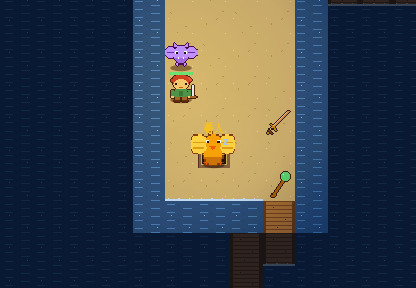
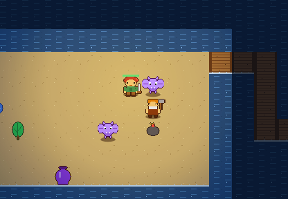
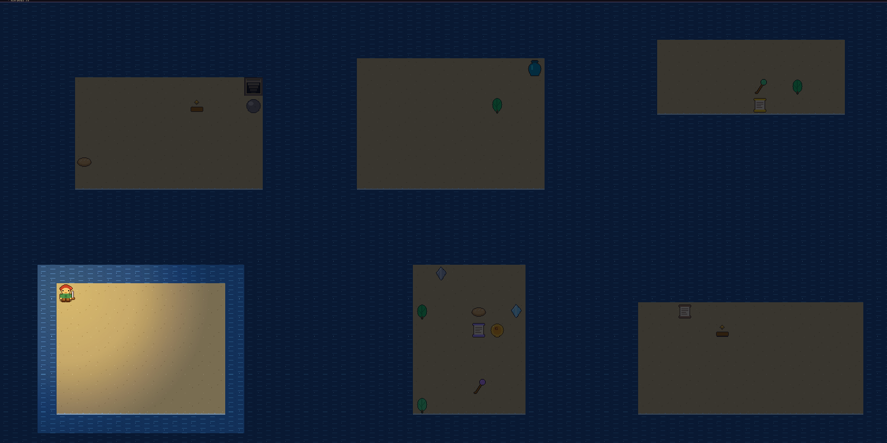
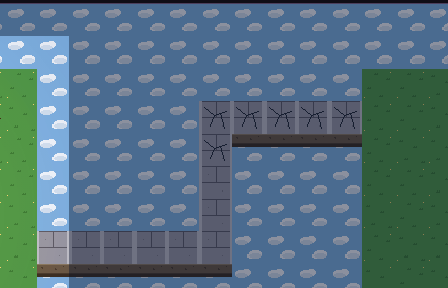
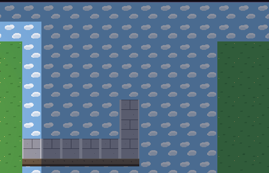

# ギミック実装記録

[09 ギミック提案](09_ギミック提案.md) をおすすめ順に実装した記録。設計の詳細と、提案からの差分をここに残す。

## 第1弾: 基盤・罠・番人・鍛冶屋

### 基盤

| 部品 | 実装 |
| --- | --- |
| `TileFeature`（`game/TileFeature.ts`） | 判別共用体 `trap / spring / fountain / sign`。`GameState.features`（位置キーの Map）で管理し、`featureAt / placeFeature / removeFeatureAt` |
| `FeatureService`（`game/FeatureService.ts`） | 発動ルール。`onEntered(actor, pos)` を `afterPlayerMoved()` から呼ぶ。落とし穴・ワープはセッションのフック（次の階へ／テレポート）に委譲 |
| `Npc`（`entity/Npc.ts`） | 中立の基底。`Shopkeeper` はこれを継承。`GameState.npcs`。ぶつかると役割ごとに会話、ダメージで `angerNpc()` → 敵化 |
| 描画 | `featureSprites.ts`（罠 6 種・跳ね床・泉・石碑・鍛冶屋）。`Renderer` が地形の上、アイテムの下に描く。隠し罠は描かない |

### 罠

| 罠 | 効果 | 備考 |
| --- | --- | --- |
| 落とし穴 | 次の階へ落ちる（最深部では落ちない） | 未払い品があれば店にはどろぼう扱い |
| 地雷 | 周囲 1 マスの全員に 20 ダメージ、床のアイテム消失。罠も消える | 敵味方問わず |
| 睡眠ガス | 3 ターン眠る（`sleep` 状態、行動不可） | 新しい状態異常 `sleep` |
| ワープ | フロアのどこかへ | |
| 錆び | 装備中の武器（無ければ盾）の修正値 −1 | 装備なしなら何も起きない |
| モンスター召喚 | 周囲に最大 3 体。罠は消える | |

- 2F 以降、部屋の床に 2〜5 個（開始部屋・店を除く）。踏むまで見えない（`hidden`）。
- 敵・仲間は踏んでも発動しない。**トラップの杖**（魔法弾）で相手の足元に罠を作って発動できる（落とし穴は敵にのみ）。
- **罠見破りの巻物**でフロアの罠を全部可視化。
- 通路ダッシュは「見えている罠・跳ね床の手前」で止まる。

### 番人の部屋

- 4F 以降 25%、階段の部屋（開始部屋でない）に、2 階上までの最高ランク種族を **HP2倍・眠り** で配置。名前は「番人の◯◯」、描画は 1.3 倍＋「番人」ラベル。
- プレイヤーが隣接すると起きる。ダメージでも起きる（既存ルール）。
- 撃破で経験値 2 倍、足元に戦利品（出現テーブルから、階層+3 相当）。仲間化はしない。

### 鍛冶屋

- 2F 以降 25%、部屋に「鍛冶屋のドワーフ」。ぶつかると装備中の武器（無ければ盾）を +1。料金 `300 + 150 × 現在の修正値`。
- 攻撃すると怒って敵（HP90・攻28）になる。

 

### テスト（`tests/features.test.ts`）

罠の配置制約、6 種の効果、敵は発動しない、巻物と杖、リプレイ再現、鍛冶屋の料金と敵化、番人の配置・起床・戦利品。

## 第2弾: 満潮・崩落・押せる岩・跳ね床・泉・石碑

### FloorEvent（`game/FloorEvent.ts`）

`GameState.events` に登録し、`endTurn()` の最後に `tick()`。地形を書き換えるので `DungeonMap.version` を増やし、`TileArt` はバージョンでキャッシュを無効化する。

| イベント | テーマ | 内容 |
| --- | --- | --- |
| `TideEvent`（満潮） | 地底湖 | 60 ターン周期。45〜59 ターン目は橋（通路）が水没。5 ターン前に予告。橋の上の者は岸へ退避、橋の上のアイテムは流される |
| `CollapseEvent`（崩落） | 天空 | プレイヤーが踏んだ回廊に「ひび」が付き、6 ターン後に空になる（乗っている者がいれば 1 ターン延期）。30 ターン後に浮き石が戻る |

崩落で階段への経路が断たれても、待てば戻るので詰まない。

### 押せる岩（`TileFeature: boulder`）

- `GameState.isOccupied()` が岩も「入れないマス」として扱うので、敵・仲間・投げ物は岩を避ける／岩で止まる。
- プレイヤーが岩へ移動すると押す。先が **水なら沈んで床に**（足場を作る）、**空なら消える**、床なら 1 マス進む（上のアイテムは潰れる）。壁・アクター・別の物があれば押せない（ターン非消費）。
- 地底湖・天空で 1〜3 個、岸に接した床に置く。

### 跳ね床・泉・石碑

- 跳ね床: 2F 以降に 1〜2 個。踏んだ者（敵・仲間も）を矢印の方向へ壁まで吹き飛ばす（`knockback` 流用）。着地点に罠などがあればそれも発動。
- 泉: 15%。回復の泉（HP・満腹度全快、1 回）／呪いの泉（装備 −1）。
- 石碑: 35%。そのフロアの事実からヒントを 1 つ（階段の方角、店・番人・鍛冶屋の有無、テーマの注意）。

 

### テスト（`tests/floorEvents.test.ts`）

満潮の周期と退避、崩落の予告・延期・復元と移動での自動マーク、岩の押し・壁・水（足場化）・空・投げ物の遮断、跳ね床・泉・石碑、生成での配置。

## 第3弾（予定）: 氷の洞窟・火山
