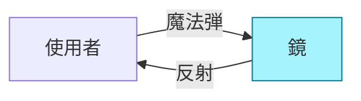
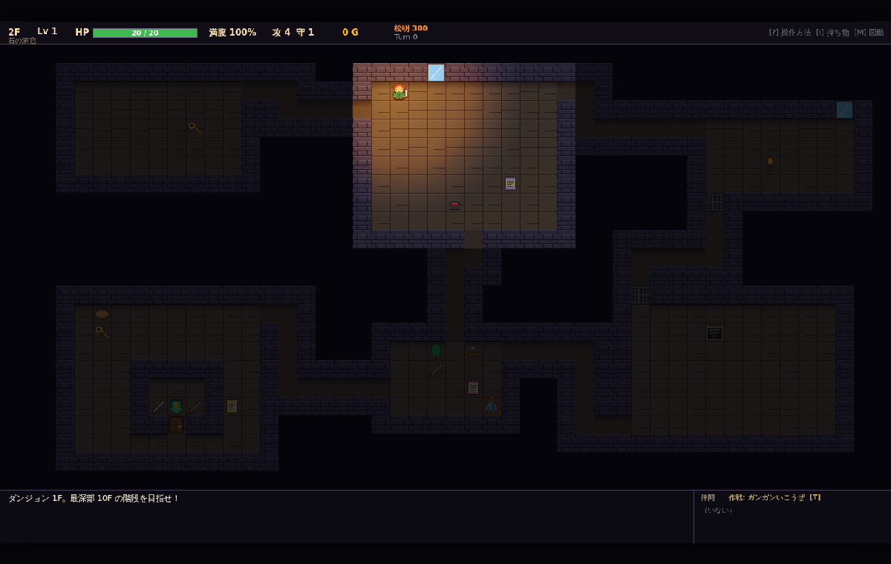
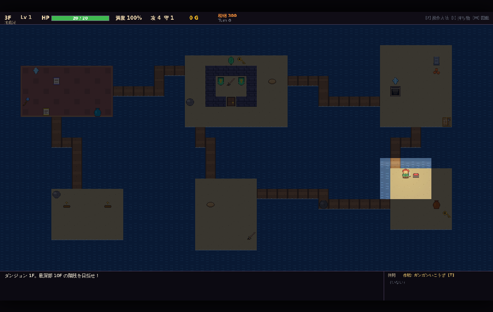
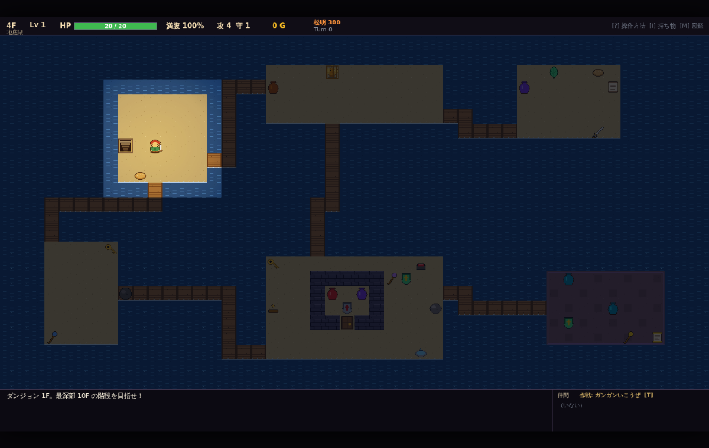
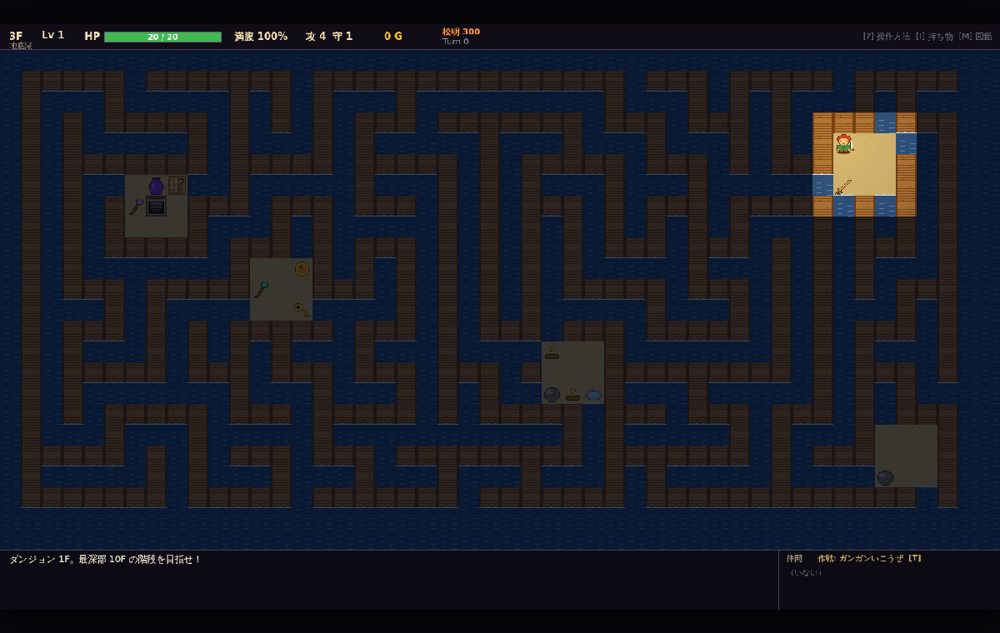
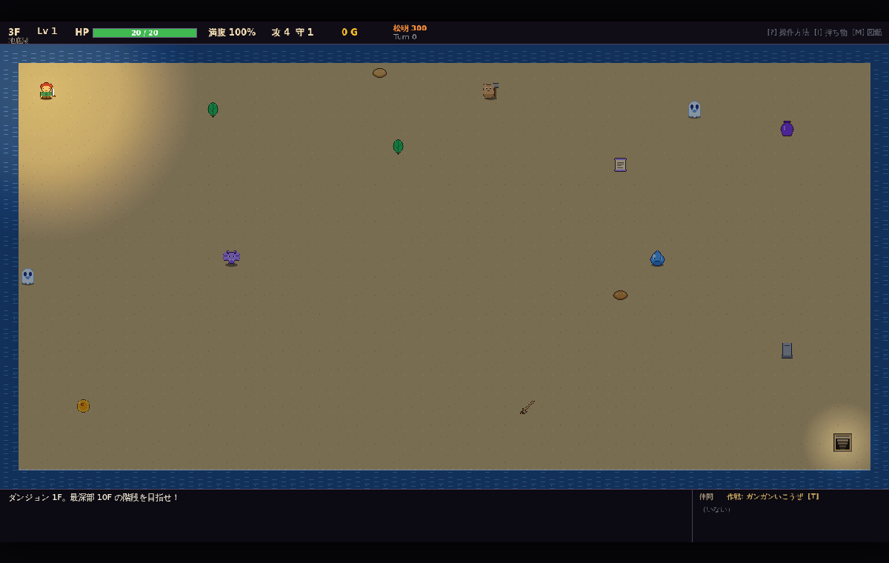
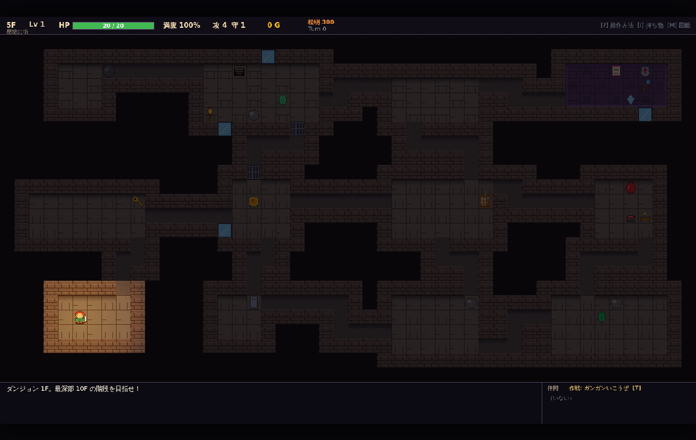
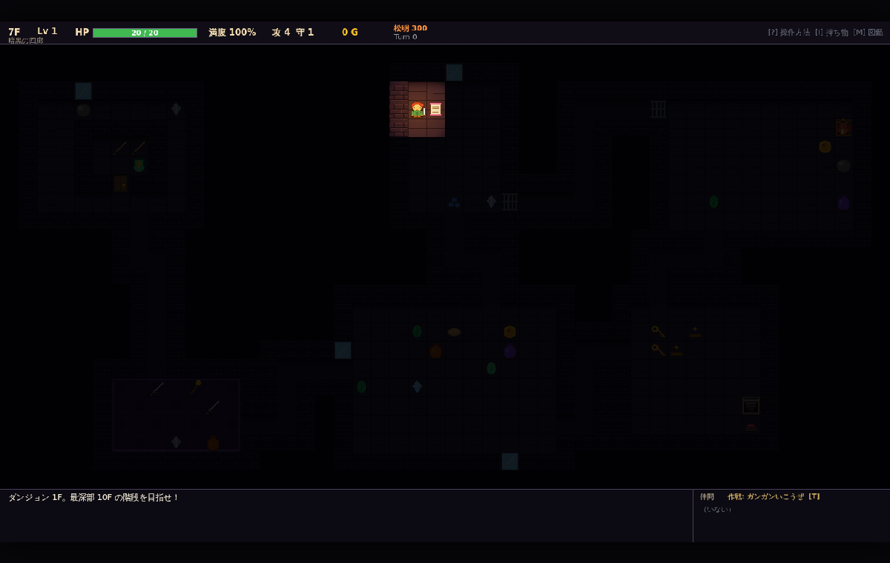

# 11. ギミック実装（第 4 弾〜第 6 弾）

`09_ギミック提案.md` で未着手だった 13 案を、3 つの弾に分けて実装した。
前提となる基盤（`TileFeature` / `FloorEvent` / `Npc`）は `10_ギミック実装.md` を参照。

| 弾 | 内容 | 主な追加ファイル |
| --- | --- | --- |
| 第 4 弾 | 鍵と扉・宝物庫、囚われた仲間、スイッチ（橋・格子）、反射壁（鏡） | `game/Projectile.ts`、`data/items.ts`（カギ・たいまつ） |
| 第 5 弾 | 霧、松明の寿命、危険度（増援）、転がる岩、闇市 | `game/FloorEvent.ts`（`RollingRockEvent`）、`map/Visibility.ts` |
| 第 6 弾 | 迷路フロア、大部屋フロア、廃墟の街、暗黒 | `map/DungeonGenerator.ts`（`layout`）、`data/themes.ts` |

---

## 第 4 弾: 鍵・扉・スイッチ・鏡

### 共通: 投擲物の経路（`game/Projectile.ts`）

投げ物・杖の魔法弾・ブレスの 3 つが個別に持っていた「直進して当たる」ループを `traceProjectile()` に統一した。

```
traceProjectile(state, from, dir, range, { stopAtActor })
  → { end, hit?, segments: [{from,to}...], reflected }
```

- 岩壁・岩・扉・格子・檻は遮る（`GameState.blocksProjectileAt()`）。水・空は飛び越える。
- **鏡（`TileType.Mirror`）** に当たると向きが反転し、来た道を戻る。反転後は使った本人にも当たる。
- `segments` は反射で折れた区間ごとの始点と終点。描画は区間ごとに `projectile` 演出を発行する。



### 鍵と扉・宝物庫（1-5）

| 要素 | 実装 |
| --- | --- |
| 扉 | `TileFeature: door`。歩行不可（`isOccupied`）・投擲不可。カギを持って体当たりすると開く（カギ消費・1 ターン） |
| カギ | アイテム `key`（素材）。フロアの別の部屋の床に置かれる。宝物庫と檻がある分だけ置かれる |
| 宝物庫 | 7×6 以上の部屋の内側に 3×2 の小部屋を壁で囲い、1 マスだけ扉にする。中には階層 +4 のテーブルから武具・種・壺・素材を 3 つ |
| 生成 | 2F 以降 25%。階段のある部屋・店・モンスターハウスは避ける |

### 囚われた仲間（3-2）

- `TileFeature: cage { defId }`。檻の中に種族スプライトを描く。
- カギを持って体当たりすると加入（確率なし、Lv1）。仲間が 3 体いると「連れて行けない」と言ってカギは消費しない。
- 2F 以降 20%。檻の分のカギも別の部屋に置かれる。

### スイッチ（1-4）

`TileFeature: switch { targets, mode: 'bridge' | 'gate', active }`。プレイヤーが踏むと 1 回だけ作動する。

| モード | テーマ | 作動前 | 作動後 |
| --- | --- | --- | --- |
| `bridge` | 地底湖・天空 | 生成器が「使わなかった接続」の経路を `map.unusedPaths` に残す。その経路は水／空のまま | 経路が通路になり、部屋同士の近道ができる |
| `gate` | 洞窟・氷・火山 | 生成器が全域木に足した「余分な接続」（`map.corridors[i].extra`）の両端に `gate`（格子） | 格子が消えて回廊が開く |

格子は余分な接続にしか置かないので、作動前でもフロアは連結している。

### 反射壁（1-8）

- `TileType.Mirror`（歩行不可・投擲物を反射）。壁テーマ（洞窟・氷・火山・廃墟・暗黒）の 2F 以降 40% で、部屋の外周の壁 2〜4 マスを鏡に置き換える。
- 敵のブレスも反射する。鏡の手前に立てば、炎を吐いた敵自身に返せる。

---

## 第 5 弾: 霧・松明・危険度・転がる岩・闇市

### 霧（2-3）

- `Visibility.sightRadius` を設定すると、部屋の中でも観測者からチェビシェフ距離 `sightRadius` までしか見えない。
- 3F 以降 15%（暗黒テーマ以外）。`state.fog = true`。描画は視界内に灰色の霞を重ねる。
- あかりの巻物は地形を「探索済み」にするだけで、視界は広がらない。

### 松明の寿命（2-4）

| 項目 | 値 |
| --- | --- |
| `Player.torch` | 初期 300 ターン、上限 400。毎ターン 1 減る |
| 描画 | 松明の半径 × `max(0.35, torch / 300)` |
| 0 になると | 部屋でも視界が半径 1 に（`sightRadius = 1`）。「松明が消えた！」 |
| 回復 | アイテム `torch`（たいまつ、道具）で +200。1F から出現、拠点の武器屋にも並ぶ |
| 警告 | 残り 60 で「松明の火が小さくなってきた…」 |

### 危険度（2-5）

`state.floorTurns`（フロア到着からのターン数）が 150 増えるごとに湧き間隔を 8 ターン短くする（下限 8）。
150 ターンで「フロアの空気が重くなってきた…」、400 ターンで「魔物の気配が濃くなっている！」。

### 転がる岩（2-6）

- `FloorEvent: RollingRockEvent`。直線の通路（長さ 6 以上）を毎ターン 1 マス進み、端で反転する。
- 岩のマスに入ったアクターには 10 ダメージ＋進行方向へ吹き飛ばし。
- `TileFeature: rock` で位置を表す（押せる岩 `boulder` とは別）。
- 通路ダッシュは、見えている `rock` があると止まる。
- 3F 以降 30%。

### 闇市（3-4）

- 店主のいない店。商品は値札なし（持ち出し自由）。
- 部屋の出口（隣接する通路マス）ごとに **番人**（`makeGuardian`）が眠っている。隣接で目を覚ます。
- 4F 以降、通常の店が無いフロアで 15%。`state.blackMarket = { room }`。描画は紫の絨毯。

---

## 第 6 弾: レイアウトと新テーマ

### 生成器のレイアウト（`GeneratorConfig.layout`）

| layout | 生成 | 使われ方 |
| --- | --- | --- |
| `sectors` | 従来（3×2 セクター） | 既定 |
| `town` | 4×3 セクター・小部屋・余分な接続 3 | 廃墟の街 |
| `maze` | 再帰的バックトラックで迷路を掘り、5 つの 3×3 広間を部屋にする | 3F 以降 10% |
| `bigRoom` | 外周 1 マスを残した 1 部屋。階段と開始位置は対角 | 3F 以降 10% |

- `FloorBuilder.build()` が階層・テーマ・乱数からレイアウトを決めて `generator.generate(rng, solid, layout)` を呼ぶ。
- 敵の湧きは「プレイヤーの部屋を避ける」が、部屋が 1 つ（大部屋）のときはプレイヤーから 8 マス以上離れたマスに湧く。

### 新テーマ

| テーマ | フロア | 特徴 |
| --- | --- | --- |
| 廃墟の街（`ruins`） | 5〜6F（氷の洞窟と半々） | `town` レイアウト。店 80%・鍛冶屋 70%。レンガ壁と石畳 |
| 暗黒（`dark`） | 7〜8F（火山と半々） | 視界半径 1（部屋でも）。あかりの巻物・松明が生命線。敵の攻撃 +3（`Monster.atkBonus`） |

フロア帯に候補が複数あるテーマは、フロア到着時の乱数で選ぶ（`pickTheme(floor, rng)`）。
`themeForFloor(floor)` は帯の先頭（従来どおり cave/water/ice/volcano/sky）を返す。

---

## スクリーンショット

| 宝物庫・檻・鏡・格子（2F） | 霧の地底湖と橋スイッチ（3F） |
| --- | --- |
|  |  |

| 闇市（紫の絨毯・出口に番人） | 迷路フロア |
| --- | --- |
|  |  |

| 大部屋フロア | 廃墟の街 | 暗黒の回廊 |
| --- | --- | --- |
|  |  |  |

## テスト（`tests/gimmicks2.test.ts`）

| 観点 | 内容 |
| --- | --- |
| 鏡 | 東に鏡を置いて杖を振ると、自分に魔法弾が返ってくる |
| 扉 | カギなしでは開かず、カギがあると消費して通れる |
| 檻 | カギで仲間になる。3 体いると加入しない |
| スイッチ | 橋モードで targets が通路になる。格子モードで gate が消える |
| 霧・松明 | `sightRadius` 設定時に部屋の遠くが見えない。松明 0 で半径 1 |
| 転がる岩 | 通路上を毎ターン移動し、端で反転する。プレイヤーに当たるとダメージ |
| 闇市 | 出口に番人、商品に値札なし |
| レイアウト | 迷路・大部屋・街のいずれも全床が連結し、階段に到達できる（30 シード） |
| 危険度 | floorTurns に応じて湧き間隔が短くなる |

---

## 関連

- [09_ギミック提案.md](09_ギミック提案.md) — 提案一覧
- [10_ギミック実装.md](10_ギミック実装.md) — 第 1〜3 弾
- [08_ダンジョンテーマとモンスターハウス.md](08_ダンジョンテーマとモンスターハウス.md) — テーマの基盤
